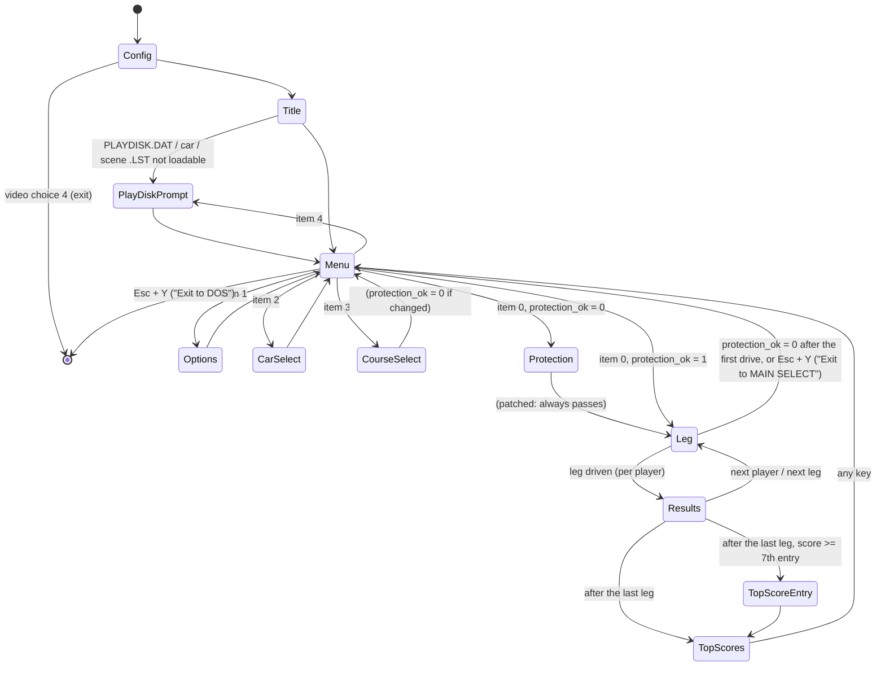

# game_flow — Test Drive III: The Passion, TDIII.EXE, segments `0000`, `01f4`, `0792`

Porting spec for everything around the driving loop: startup (config, memory, "RAM check"), fatal
messages, the in-game message box, the key poll and hotkeys, the title / Accolade / credits sequence,
the main select screen with its rotating 3D car, options (skill level, opponents), car and course
select, the PLAY DISK screen, the copy-protection state (bypassed), `race_run` and its frame loop,
stage loading, the leg/player loop in `main` with the results arithmetic, the results pages, the
top-score table and the `.HI` file.

Conventions follow `port/RE_GUIDE.md`: code addresses `SSSS:OOOO` as stored in the file, `DS:xxxx` =
DGROUP `1BE4` (image `0x1BE40 + xxxx`). File formats are cited from `FORMATS.md` and
`port/formats/*.md`, not repeated. Names of functions owned by other specs are the ones in
`port/symbols.csv` when they exist, otherwise provisional descriptive names marked *(prov.)*; §2b
lists them.

Every function here was read in `port/decomp/tdiii_ds.c`; `main` (0000:0000–07e3), `race_run`
(0792:000c–0413), `draw_leg_record`, `car_next`, the message-box jump table (0000:1d8e), the hash and
`random` were checked against the disassembly (`tools/x86dis.py`). Where the decompile was wrong or
garbled (the results arithmetic in `main`, the `music_for_state` decompile, which contains a copy of
`main`), the pseudocode follows the disassembly.

The per-frame HUD (`0792:0414`'s call of `0792:1310`, `0792:10c8`, `15d4`, `16c4`, `18da`, `1952`,
`1156`, `1488`, `155e`) is the **hud** spec. The cockpit set-up `0792:0922`, the chase/replay
view switches `04ca/059a/0602` and the crash pictures `0792:19ca/1a72/1c00/1c66` are called from
`race_run`; they are summarised here (§4.13, §4.15) under the names of `hud.md`, which owns their
drawing details.

---

## 1. Overview

`main` (0000:0000) is a plain C function called from the MSC startup code. After the setup it loops
on the word `game_state` (DS:0086):

| state | what runs | next |
|---|---|---|
| FFh | set during `config_load` and startup | 1 |
| 1 | `title_sequence`, `shared_scene_load`, `playdisk_load` (on failure `playdisk_prompt`) | 4 |
| 2 | `copy_protection_check` (patched to return 0 → `protection_ok = 1`) | 5 |
| 3 | `top_scores_screen` if the table is not empty | 4 |
| 4 | `shared_scene_load`, music, then `main_menu` in a loop; the choice runs options / car select / course select / PLAY DISK; "race" → 5 (or 2 while `protection_ok` = 0) | 2 / 5 |
| 5 | race: legs × players, `race_run` per player per leg, results arithmetic, results pages; after the last leg the top-score entry | 3 (or 4) |
| 6 | set after each drive while the results are shown (so that `pal_load` uploads palettes); seen at the top of the loop only after "Exit to MAIN SELECT" (Esc + Y) in a race | 4 |

`protection_ok` (DS:0088) drives the old demo mode: without it each player gets **1 life**, the leg
ends at 2:00 on the race clock ("Your time is up..."), no results are shown and the game goes back to
the menus after the first leg. The check itself is patched out in this copy (returns 0 = passed), so
in practice the first "race" choice passes through state 2 and sets `protection_ok = 1`. Changing the
course clears it again (the scenery disk has its own code sheet), so state 2 runs again. The port
keeps the states and makes `copy_protection_check` return 0 (PLAN.md decision 3, §9).

A **race** (state 5) runs the scene's legs (DS:0B0B, 5 in both scenes). For each leg, each of the
1–4 human players (DS:0B08) with lives left drives the leg in turn with `race_run`. Per-player state
(times, distances, score, lives) lives in 27-byte records at DS:E7F4; the current player's record
is copied to DS:09C6 (`player_rec_load`) and back (`player_rec_save`). After each drive `main`
computes the leg time, distance, average speed and score and the cumulative values, then shows the
leg banner, the scorecard (`leg_results`, which also updates the `.HI` records) and, with several
players or computer cars, the race-status page. After the last leg every player whose score beats
the 7th top score enters a name (`top_score_enter`), and state 3 shows the table.

All screens are built on the back page (page 1) and shown with `screen_present` (a 64-step dissolve,
platform) or with rectangle copies; palettes are loaded into the buffer DS:0B6A and faded by the
platform. Pictures are LZW+RLE files (FORMATS.md "Pictures") decompressed into DS:2500 and drawn with
`pic_draw`.

### 1.1 Call graph

```
_astart 1940:0018
└─ main 0000:0000
   ├─ getcwd → drive letter; config_load 0000:092a ── cfg_show_* 0ce6/0d0e/0d36, exit_to_dos 07e4, fatal_exit 0874
   ├─ ega_pal_init 01f4:1c9c, kbd_install 0c1c:0e2d, snd_init 01f4:1cf0, mem_alloc_all 0000:11d2
   ├─ render_init 0e12:2537, _harderr(harderr_handler 0000:081c), file_load_far ×4 (COMPASS/WATER/CHASE/BROKE)
   ├─ mouse init 16e6/16f5/16ec
   ├─ [1] title_sequence 01f4:0070 ── credits_text 01f4:19f4
   │      shared_scene_load 01f4:53c4, playdisk_load 01f4:28ae, playdisk_prompt 01f4:26fe ── playdisk_screen 01f4:2f0e
   ├─ [2] copy_protection_check 01f4:1ec2 (returns 0)
   ├─ [3] top_scores_screen 01f4:0f4e ── print_score 01f4:12d4, car_lst_load 01f4:29f0
   ├─ [4] main_menu 01f4:144c ── menu_box_draw 01f4:18b0, stage_load_objects, car_leg_reset, frame_update/frame_draw
   │      options_screen 01f4:3b2e, car_select 01f4:310c (car_next/prev, car_select_draw),
   │      scene_select 01f4:3636 (scene_next/prev, scene_select_draw), playdisk_prompt 01f4:26fe
   └─ [5] playdisk_verify, per leg / per player:
          player_rec_load 01f4:000e
          race_run 0792:000c
          │  ├─ stage_load_objects 0792:0d2e ── leg_map_load 0792:0fce, file_load_*, leg_state_reset 0e12:255e
          │  ├─ car_leg_reset 0792:083c, hud_reset_topbar 0792:10a6, cockpit_setup 0792:0922 (hud) ── view_first_frame 0792:0cec
          │  └─ frame loop: frame_update 0e12:76ec, race_input(0) 0792:0414, frame_draw 0e12:77d5, race_input(1),
          │                 HUD (0792:10c8, tach_draw 15d4, odometer_draw 16c4, odometer_update 1952), blit 0c1c:13d8,
          │                 race_input(2), random, surface events, ≥ 5-tick wait;
          │                 on events: message_box 0000:179c, chase_view_exit 04ca / chase_view_enter 059a
          │                 (replay_panel_draw 0602), water_overlay_start 19ca / broken_glass_overlay 1c00 / water_roll_step 1a72,
          │                 crash_resolve 0e12:044e (prov.)
          opponent_results 01f4:55f0
          results arithmetic (inline), leg_banner_draw 01f4:3f8e, leg_results 01f4:4954
          │  └─ results_frame_draw 01f4:470e, leg_record_merge 01f4:51e2, hi_write 01f4:2e66, draw_leg_record 01f4:4d7e
          player_rec_save 01f4:003e, race_status_screen 01f4:40ce
          after the last leg: top_score_enter 01f4:0a96 ── hi_write
key_poll 0000:0f80 (called from every screen and from race_input) ── joystick_keys 0000:1e44 ── joystick_direction 1ea4
    hotkeys → message_box 0000:179c, music_for_state 01f4:1d22 (sound), music_stop, sfx_play
```

### 1.2 Screen flow



Esc outside a race opens "Exit to DOS (Y/N)?" from any screen that polls keys (it is handled inside
`key_poll`); inside a race it opens "Exit to MAIN SELECT SCREEN (Y/N)?".

### 1.3 Inside a leg (race_run)

```
race_run:
  load stage + car, build cockpit, "Player n, ready to drive...." (several players)
  loop:
    if race_state == 3 → leave (computer-car results, sounds off, black palette, clear page 0)
    frame_ticks = ticks since last frame start; frame start = now
    if view mode or race_state changed → cockpit/external view switches, crash sequence, restart
    pending message → message_box
    frame_update ; race_input(0) ; frame_draw ; race_input(1)
    cockpit HUD (not crashed, not external) ; blit 3D window (race_state 1) ; race_input(2)
    random() ; surface under the car changed → weather steps / finish (1Fh → race_state 3)
    demo mode: clock minutes == 2 → "Your time is up..." → race_state 3
    wait until 5 timer ticks (145.6 Hz) since the frame start, calling random() while waiting
```

---

## 2. Function table

Confidence: **verified** = checked against the disassembly or data; **likely** = read in the
decompile, consistent; **guess** = name/purpose inferred.

### 2a. Functions of this subsystem

| Address | Name | Signature | Purpose | Conf. |
|---|---|---|---|---|
| 0000:0000 | main | `void(void)` | startup, state machine, legs × players, results arithmetic | verified |
| 0000:07e4 | exit_to_dos | `far void(void)` | shut everything down, `exit(0)` | verified |
| 0000:081c | harderr_handler | `far void(u16, u8 err)` | INT 24h: "Write Protect?" / "Drive Not Ready?", retry | likely |
| 0000:0874 | fatal_exit | `far void(int code)` | shut down, print a fatal message on the text screen, `exit(code)` | verified |
| 0000:092a | config_load | `far void(void)` | TD3.CFG or text-mode prompts; graphics mode and pages | verified |
| 0000:0ce6 | cfg_show_video_choice | `far void(char)` | text digit at (20h, 8) | verified |
| 0000:0d0e | cfg_show_sound_choice | `far void(char)` | text digit at (20h, 11h) | verified |
| 0000:0d36 | cfg_show_yes_no | `far void(int)` | "N"/"Y" at (2Ch, 15h) | verified |
| 0000:0d62 | pal_load | `far void(char *name)` | 112 colours → palette buffer at 16 + DS:90F0 | verified |
| 0000:0df6 | pal_load_32 | `far void(char *name)` | 32 colours → palette buffer at 48 + DS:90F0 | verified |
| 0000:0e74 | file_load_near | `far void(char *name, u8 *dst)` | whole file/entry into a DS buffer | verified |
| 0000:0ee0 | file_load_far | `far void(char *name, void far *dst)` | whole file/entry into a far buffer | verified |
| 0000:0f58 | random | `far u16(void)` | LCG, 15-bit result | verified |
| 0000:0f80 | key_poll | `far void(u16 *key)` | read key / joystick, hotkeys, DS:E08C | verified |
| 0000:11d2 | mem_alloc_all | `far void(void)` | all far buffers; failure = "Not enough RAM" | verified |
| 0000:1442 | mem_free_all | `far void(void)` | free them | verified |
| 0000:1518, 151a | nop_1518, nop_151a | `far void(void)` | empty | verified |
| 0000:151c | archive_open | `far int(char *name)` | archive lookup, open with disk prompts, seek | verified |
| 0000:16d0 | name_hash_h1 | `far int(char *, int mul)` | FORMATS.md hash h1 | verified |
| 0000:171a | name_hash_h2 | `far int(char *)` | FORMATS.md hash h2 | verified |
| 0000:1760 | name_hash | `far u32(char *)` | (h1 << 16) \| h2 | verified |
| 0000:179c | message_box | `far void(int id)` | message box with per-message behaviour | verified (switch table) |
| 0000:1e44 | joystick_keys | `far u16(u16 *key)` | joystick → key code | likely |
| 0000:1ea4 | joystick_direction | `far void(void)` | calibration widening, direction bits | verified |
| 01f4:000e | player_rec_load | `far void(void)` | player record → DS:09C6 | verified |
| 01f4:003e | player_rec_save | `far void(void)` | DS:09C6 → player record | verified |
| 01f4:0070 | title_sequence | `far int(void)` | logo, title, credits | likely |
| 01f4:0a96 | top_score_enter | `far void(void)` | name entry and table insert | likely |
| 01f4:0f4e | top_scores_screen | `far int(int)` | top-7 table screen | likely |
| 01f4:12d4 | print_score | `far void(u32)` | decimal without leading zeros | verified |
| 01f4:144c | main_menu | `far int(void)` | main select screen | likely |
| 01f4:1864 | gfx_frame | `far void(x0,x1,y0,y1)` | rectangle outline | verified |
| 01f4:18b0 | menu_box_draw | `far void(int item, int c, int c2)` | menu item frame | likely |
| 01f4:19f4 | credits_text | `far int(char *)` | credits lines | likely |
| 01f4:1a82 | print_records | `far int(u8 *, int)` | print {col,row,text} records | verified |
| 01f4:1ad6 | print_text | `far int(u8 *, int)` | print until byte ≥ 80h | verified |
| 01f4:1b0a | print_record | `far int(u8 *, int)` | one record | verified |
| 01f4:1b58 | print_chars | `far void(u8 *, int n)` | n characters | verified |
| 01f4:1b8e | wait_key | `far int(int n)` | timed key wait | verified |
| 01f4:1be2 | screen_present | `far void(void)` | page 0 + dissolve | likely |
| 01f4:1c00 | ega_pal_black | `far void(void)` | EGA only | likely |
| 01f4:1c34 | ega_pal_restore | `far void(void)` | EGA only | likely |
| 01f4:1c48 | pal_apply | `far void(void)` | VGA palette upload | verified |
| 01f4:1c56 | pal_black | `far void(void)` | VGA black palette | verified |
| 01f4:1c64 | pal_fade_in | `far void(void)` | VGA 16-step fade in | verified |
| 01f4:1c72 | pal_fade_out | `far void(void)` | VGA 16-step fade out | verified |
| 01f4:1c80 | pal_fade_out_low | `far void(void)` | VGA fade out of colours 0–127 | verified |
| 01f4:1c8e | page_keep_high | `far void(void)` | pixels < 80h → 0 on the active page | verified |
| 01f4:1c9c | ega_pal_init | `far void(void)` | EGA/Tandy palette registers | likely |
| 01f4:1ec2 | copy_protection_check | `far int(void)` | returns 0 (patched) | verified |
| 01f4:262a | protection_picture_draw | `far void(int n, int x)` | dead code | likely |
| 01f4:26fe | playdisk_prompt | `far void(void)` | drive + disk prompts, PLAY DISK screen | likely |
| 01f4:2736 | playdisk_write | `far void(void)` | write PLAYDISK.DAT (descriptions.md) | verified |
| 01f4:2812 | playdisk_verify | `far void(void)` | label check loop | verified |
| 01f4:28ae | playdisk_load | `far int(void)` | read PLAYDISK.DAT + car + scene | verified |
| 01f4:29f0 | car_lst_load | `far int(int slot, char *path, char *name, u16 *pics)` | descriptions.md | verified |
| 01f4:2bc6 | scene_lst_load | `far int(int slot, char *path, char *name)` | descriptions.md (+ .HI) | verified |
| 01f4:2e66 | hi_write | `far void(void)` | write `<scene>.HI` | verified |
| 01f4:2f0e | playdisk_screen | `far void(void)` | PLAY DISK screen | likely |
| 01f4:310c | car_select | `far void(void)` | car select with scrolling spec card | likely |
| 01f4:3332 | car_next | `far int(int)` | next loadable car slot | verified |
| 01f4:3396 | car_prev | `far int(int)` | previous loadable car slot | verified |
| 01f4:33f8 | car_select_draw | `far void(void)` | car select pictures | likely |
| 01f4:3636 | scene_select | `far void(void)` | course select | likely |
| 01f4:36de, 373e | scene_next, scene_prev | `far int(int)` | as car_next/prev | verified |
| 01f4:379c | scene_select_draw | `far void(void)` | course select pictures | likely |
| 01f4:3b2e | options_screen | `far void(void)` | skill level, opponents | likely |
| 01f4:3f8e | leg_banner_draw | `far void(void)` | leg pictures on page 1 | likely |
| 01f4:40ce | race_status_screen | `far void(void)` | race status page | likely |
| 01f4:470e | results_frame_draw | `far void(int)` | results page frame + DETAIL picture | likely |
| 01f4:4954 | leg_results | `far void(void)` | scorecard, records, .HI update | likely |
| 01f4:4d7e | draw_leg_record | `far void(int x, int y, u8 *rec, u8 hl)` | one record line | verified |
| 01f4:51e2 | leg_record_merge | `far int(u8 *new, u8 *best)` | field-wise best | likely |
| 01f4:53c4 | shared_scene_load | `far int(void)` | front-end pictures, shared scene sets | likely |
| 01f4:55f0 | opponent_results | `far void(void)` | computer cars' results | likely |
| 01f4:59ac | pic_draw | `far void(pairs, n, w, x, ybot, flag)` | RLE picture draw dispatch | verified |
| 0792:000c | race_run | `far void(void)` | one leg | verified |
| 0792:0414 | race_input | `far void(int phase)` | input between frame phases | likely |
| 0792:04ca | chase_view_exit | `far void(void)` | back to cockpit view | likely |
| 0792:059a | chase_view_enter | `far void(void)` | to chase/replay view | likely |
| 0792:0602 | replay_panel_draw | `far void(void)` | chase/replay panel | likely |
| 0792:083c | car_leg_reset | `far void(void)` | car state at leg start/restart | likely |
| 0792:0922 | cockpit_setup | `far void(void)` | cockpit (hud owns details) | likely |
| 0792:0cec | view_first_frame | `far void(void)` | one render | verified |
| 0792:0d2e | stage_load_objects | `far void(void)` | leg loading | likely |
| 0792:0fce | leg_map_load | `far void(void)` | leg map | likely |
| 0792:10a6 | hud_reset_topbar | `far void(void)` | redraw markers, page 0 | verified |
| 0792:19ca | water_overlay_start | `far void(void)` | water crash picture (hud) | likely |
| 0792:1a72 | water_roll_step | `far void(void)` | water crash: one step of the rolling water picture (hud) | likely |
| 0792:1c00 | broken_glass_overlay | `far void(void)` | broken windscreen (hud) | likely |
| 0792:1c66 | cockpit_pictures_draw | `far void(int ybot)` | cockpit pictures (hud) | likely |
| 0792:1dfe | load_opponent_pob_nonvga | `far void(void)` | non-VGA only | verified |

`01f4:1cf0 snd_init`, `1d22 music_for_state`, `1e48 music_play_theme`, `1e9a snd_shutdown` are in this
segment but belong to the **sound** spec (already named). `music_for_state(station)` plays THEME.MUS
in state 1, NEWWAVE.MUS in the menus, and the scene's A/B/C.MUS by radio station in a race.

### 2b. External functions used here

Names from `platform.md`, `hud.md` and `port/symbols.csv`; *(prov.)* = provisional, no spec yet.

| Address | Name | Owner | Use here |
|---|---|---|---|
| 0e12:76ec | frame_update | simulation/render3d | per frame: world + car update (clock tick `0e12:0b1d` inside), first draw pass |
| 0e12:77d5 | frame_draw | render3d | second draw pass (3D window into the RAM buffer) |
| 0e12:0080 | controls_update | simulation | continuous driving input for DS:E08C |
| 0e12:0084 | key_code_dispatch | simulation/hud | per-frame key commands (tables at 0e12:0000 / DS:B6EF) |
| 0e12:044e | crash_resolve *(prov.)* | simulation | after a crash/replay: `lives--`, race_state 2 (restart, DS:E561 = 1) or 3 |
| 0e12:0fa1 | screen_shake | platform/simulation | countdown DS:947C, CRTC offsets; skipped when DS:E776 = 13h |
| 0e12:0b1d | topbar_update | hud | race clock (1 s = 5 frames) + clock/compass/radar draws |
| 0e12:2465 | leg_start_reset *(prov.)* | simulation | car/world state at leg start or restart |
| 0e12:2537 | render_init | render3d | DS:90D0 / 90D2 = paragraph segments of DS:CC5C and DS:E7DC |
| 0e12:255e | leg_state_reset | world | |
| 0e12:261c | build_colour_remap | objects | after weather steps |
| 0e12:2789 | sprites_prescale | world | |
| 0e12:409c | view_window_setup *(prov.)* | render3d | 3D window rows (menu 56h, race 60h, half window 40h) |
| 0e12:61fd | opponents_finish *(prov.)* | simulation | writes the computer cars' leg time/distance into DS:E80F.. / DS:E82A.. |
| 0e12:7c21 | view_overlays *(prov.)* | render3d | |
| 0977:13da | demo_keys *(prov.)* | — | empty |
| 0ab4:0047 | lzw_decode | platform | FORMATS.md; `(far src, near dst)` |
| 0ab4:000f / 0034 | lzw_alloc / lzw_free | platform | 300h-paragraph DOS block → DS:E7DC |
| 0ab4:120f | replay_clear *(prov.)* | simulation | zeroes 800h words at DS:020F (the config text area is reused as the replay buffer) |
| 0792:10c8, 1310, 15d4, 16c4, 1952 | shifter_update, wheel_update, tach_draw, odometer_draw, odometer_update | hud | per-frame instruments |
| 0c1c:0e2d / 0e7d | kbd_install / kbd_restore | platform | INT 9 |
| 0c1c:109f / 10cf | timer_install / timer_restore | platform | via snd_init / snd_shutdown |
| 0c1c:0664, 06d8 | joy_read_raw, joy_read | platform | port 201h |
| 0c1c:0733 | text_set_colours(fg, bg) | platform | DS:90E3 = fg<<8, DS:90E1 = bg<<8 |
| 0c1c:074c | text_goto_cell(row, col) | platform | y = row·8, x = col·8 |
| 0c1c:076b | text_goto(y, col) | platform | y in pixels, x = col·8 |
| 0c1c:0784 | text_draw_char(u8 *c) | platform | proportional 8×8 font; advances DS:90E5 |
| 0c1c:1f32 | print_text_bios(str, col, row) | platform | BIOS text screen (config, fatal, disk prompts) |
| 0c1c:0868/087a/08a0/08b9/084e | dos_open_read / dos_file_size / dos_read / dos_close / dos_seek | platform | archive_open, loaders |
| 0c1c:08c5 | dissolve_page1_to_0 | platform | 64 steps, one per timer tick |
| 0c1c:0b5b/0b89/0bb7/0be5/0c16/0c2a | pal_fade_out / page_clear_low_colours / pal_fade_out_low / pal_fade_in / pal_black / pal_set | platform | through the 01f4:1c48..1c8e wrappers |
| 0c1c:0c45 / 1b8a | rle_draw_page / rle_draw_dither | platform | through pic_draw |
| 0c1c:11f7 / 1303 | rect_save / rect_restore | platform | message box background |
| 0c1c:13d8 | view_present | platform | 3D buffer → screen page 0 |
| 0c1c:15c7 | page_mirror_left_half | platform | x 0–159 mirrored into 160–319 |
| 0c1c:1759 | rle_draw_viewbuf | platform | 320-wide runs into the 3D buffer, colour 0Fh transparent |
| 16fb:0008, 16d9:0002 | gfx_move_to, gfx_line_to | platform | |
| 16e5:0007 (Ghidra 16d9:00c7) | gfx_get_draw_seg | platform | page segments DS:90CC/90CE |
| 1703:0001 | gfx_set_colour | platform | |
| 1714:000e | gfx_set_draw_page | platform | always paired with DS:009A = p |
| 170e:0002 | gfx_set_copy_page | platform | end of message_box (hud calls it gfx_show_page) |
| 171b:000a | gfx_set_visible_page | platform | config_load (0: no-op) |
| 172d:000e / 1736:0004 | gfx_alloc_page / gfx_free_page | platform | page 1; DOS error 8 → fatal_exit(1) |
| 173c:0005 | gfx_put_pixel | platform | colon/dot in draw_leg_record |
| 1776:0008 | gfx_set_display_offset | platform | main_menu (0,0) |
| 1785:000b | gfx_fill_rect(x0, x1, y0, y1) | platform | current colour |
| 17eb:0006 | gfx_copy_rect_from_copy_page | platform | scene_select_draw (full screen) |
| 1818:0003 | gfx_copy_rect(x0,x1,y0,y1, dx, dy_bottom, src, dst) | platform | destination given by its **bottom** row |
| 185f:000b / 18b3:0004 | gfx_draw_bitmap / gfx_read_bitmap(ptr, bytes_per_row, rows) | platform | 1-bpp, rows upward from the pen |
| 18f3:0002 | gfx_set_ega_palette | platform | non-VGA |
| 16e6:000e / 16f5:0008 / 16ec:0004 / 16ef:0009 | mouse_init / mouse_show / mouse_set_range / mouse_set_pos | platform | INT 33h |
| 16ff:000b | bios_wait_ticks(n) | platform | INT 1Ah, 18.2 Hz |
| 16e5:000b / 16cf:0006 | gfx_get_mode / gfx_detect | platform | |
| 16fc:000b | text_exit_clear | platform | on exit |
| 1905:000b | gfx_set_mode | platform | |
| 1940:0308/0334/0526/0240 | fopen / fread / fwrite / fclose | RTL | |
| 1940:0681/066c | _fmalloc / _ffree | RTL | |
| 1940:07c4/07dc/08a6/08f3 | getch / getcwd / _harderr / _hardresume | RTL | |
| 1940:0998/08fc/0a14/0a76/09f0 | _aFlmul / _aFldiv / _aFuldiv / _aFulrem / _aFuldiv-assign | RTL | |
| 1ace:00b4 / 004b, 0c1c:1110 | music_stop / music_play, sfx_play | sound | |

`0000:0f80 key_poll` is called `key_read` in hud.md and `get_key` in platform.md.

---

## 3. Globals

The full list with types is in `game_flow_symbols.csv`; the ones that carry the flow:

| DS | Name | Type | Meaning | Written by | Read by |
|---|---|---|---|---|---|
| 0086 | game_state | u16 | main state (see §1) | main, key_poll (no), shared_scene_load (no) | main, pal_load, key_poll, shared_scene_load |
| 0088 | protection_ok | u8 | 1 = full game | main (state 2), scene_select (clears) | main, race_run, stage loaders |
| 008A | race_state | u16 | 1 drive, 2 restart, 3 leave | stage_load_objects, race_run, key_poll, crash_resolve, 0ab4:1220 | race_run, engine |
| 008C | key_hit | u8 | a key was polled; aborts sequences | key_poll, screens | title, credits, results |
| 0080 | leg_score | u32 | last leg score (temp) | main | — |
| 0084 | shared_loaded | u8 | shared data loaded | shared_scene_load, stage_load_objects | same |
| 0092/0094 | joystick_on / joystick_analog | u8 | hotkeys | key_poll | joystick, 0e12:09d6 |
| 0095 | auto_shift | u8 | skill < 3 | main | 0e12 |
| 009A | active_page | u16 | 0/1 | everyone drawing | platform |
| 00A0 | timer_ticks | u16 | 145.6 Hz counter (reset to 0 by the title) | timer ISR, title | race_run, title, dissolve |
| 00D2 | rand_seed | u32 | LCG state | random | random, engine |
| 09C4 | menu_preview | u8 | main-menu 3D preview | main_menu | loaders, engine |
| 09C5 | cur_player | u8 | 1-based | main | results, race_run |
| 09C6..09DE | current player record | 25 bytes | see below | main, race_run (lives) | results |
| 0B0A | leg_index | u8 | current leg | main, key_poll (Esc+Y → leg_count) | everyone |
| 0B0B | leg_count | u8 | legs of the scene | scene_lst_load | main |
| 9488 | pending_msg | u16 | message shown by race_run next frame | engine | race_run |
| 948B | external_view | u8 | 0 cockpit / 1 chase or replay | engine, main_menu | race_run, engine |
| B6CC | radio_station | u8 | music 0–2 | title, scene_select, engine (station key) | music_for_state callers |
| B70A/B/C | clock_frac/sec/min | u8 | race clock (0e12:0b1d) | simulation | main |
| B70E | frame_ticks | u8 | ticks of the previous frame | race_run | simulation (steering), top bar readout 0e12:0cbe |
| BA9B | surface_under_car | u8 | | render3d | race_run |
| E5AC | menu_choice | u16 | main-menu item | main, main_menu | main |
| E7F4 | player_recs | u8[4][27] | per player | main, 0e12:61fd | results |
| E338 | video_mode | u16 | 13h VGA | config_load | everyone (VGA branches) |
| 90F0 | pal_offset | u8 | 0/80h colour set | screens | pic_draw, pal_load |
| 915B | last_key | u8 | ISR key code | ISR, screens (clear) | key_poll, message_box |
| 915C | keys_held | u8 | held arrow bits | ISR | car_select |

**Player record** (27 bytes at DS:E7F4 + 1Bh·p, p = 0..3; bytes 0–18h are copied to DS:09C6):

| Off | DS (current) | Content |
|---|---|---|
| 00 | 09C6 | leg record: min, sec, frac, average mph (u8), score u32 — `.HI` record layout (descriptions.md) |
| 08 | 09CE | leg distance: units (miles), 1/60 units |
| 0A | 09D0 | cumulative record: min, sec, frac, average, score u32 |
| 12 | 09D8 | cumulative distance: units, 1/60 |
| 14 | 09DA | total score u32 (`race_score`) |
| 18 | 09DE | lives |
| 19–1A | — | not copied, never used |

For computer cars (`race_computer_cars`) records 1 and 2 (DS:E80F, DS:E82A) hold the two opponents;
`0e12:61fd` fills their time and distance, `opponent_results` the rest.

The third byte of a record (`frac`) comes from `clock_frac` (0–3, see §7) and is treated as tenths:
×10 in the hundredths arithmetic and a carry at 10. `descriptions.md` calls it "hundredths"; see §9.

---

## 4. Pseudocode

Types: `u8/u16/u32` unsigned, `i16/i32` signed; `int` = i16. Constants in hex as in the code.
Graphics calls use the platform names of §2b; `page(p)` = `active_page = p; gfx_set_draw_page(p)`.
`draw_pic(buf, pairs, w, x, ybot, flag)` = `lzw_decode(buf, sprite_set); pic_draw(sprite_set, pairs,
w, x, ybot, flag)`; `load_pic(name, buf)` = `file_load_far(name, buf)`.
`VGA` = `video_mode == 0x13`.

### 4.1 main — 0000:0000 (verified)

```c
void main(void)
{
    game_state = 0; protection_ok = 0; key_hit = 0; playdisk_ok = 0; text_transparent = 0;
    getcwd(scratch_buf, 0x4f);
    char d = scratch_buf[0] & 0xdf;                     /* current drive, upper case */
    /* patch the drive of every path: */
    playdisk_drive = path_playdisk[0] = path_scene[0] = path_opponent[0] = path_car[0] =
    path_playdisk_dat[0] = path_program[0] = DS_1FB8 = archive_path[0] = DS_1921 = DS_1A01 = d;
    game_state = 0xff;
    config_load();
    ega_pal_init();
    kbd_install();
    snd_init();
    mem_alloc_all();
    render_init();                                  /* 0e12:2537 */
    _harderr(harderr_handler);                          /* far ptr DS:00D6 */
    strcpy(path_program + 2, "COMPASS.LZ");  file_load_far(path_program, compass_pic);
    strcpy(path_program + 2, VGA ? "WATER.LZ" : "WATEREGA.LZ"); file_load_far(path_program, water_pic);
    strcpy(path_program + 2, "CHASE.LZ");    file_load_far(path_program, chase_pic);
    strcpy(path_program + 2, VGA ? "BROKE.LZ" : "BROKEGA.LZ");  file_load_far(path_program, broke_pic);
    game_state = 1;
    mouse_init(); mouse_show(0); mouse_set_range(2, 0x13d, 2, 0xc6);

    u16 last_leg_done;                                  /* [bp-0Eh] */
    for (;;) switch (game_state) {
    case 1:
        title_sequence();
        shared_scene_load();
        if (playdisk_load() != 0) playdisk_prompt();
        game_state = 4;
        break;
    case 2:
        if (copy_protection_check() == 0) protection_ok = 1;
        game_state = 5;
        break;
    case 3:
        if (hi_scores[0] != 0) top_scores_screen(0);
        game_state = 4;
        break;
    case 4:
        shared_scene_load();
        music_for_state(radio_station);
        while (game_state == 4) {
            leg_index = 0; menu_choice = 0;
            main_menu();
            if (menu_choice == 4) playdisk_prompt();
            if (menu_choice == 3) scene_select();
            if (menu_choice == 2) car_select();
            if (menu_choice == 1) options_screen();
            if (menu_choice == 0) game_state = protection_ok ? 5 : 2;
        }
        break;
    case 5:
        race();                                         /* inline in the original, §4.1.1 */
        break;
    case 6:
        game_state = 4;
        break;
    default:
        break;                                          /* FFh never reached here */
    }
}
```

#### 4.1.1 State 5: legs × players and the results arithmetic (verified against 0000:0246–07e3)

Port this exactly: 32-bit unsigned products that wrap, the signed divide for averages, the u8
truncation of averages, and the 16-bit product `(skill+4)·avg`. Time here is **clock time** (1 clock
second = 5 race frames, §7.1), distance is the odometer (1/60 mile after the metric conversion), so
the average speed is miles per clock hour.

```c
static u32 hundredths(u8 min, u8 sec, u8 frac)       /* min·6000 + sec·100 + frac·10, u32 */
{ return (u32)min * 6000 + (u32)sec * 100 + (u32)frac * 10; }

void race(void)
{
    playdisk_verify();
    leg_index = 0;
    last_leg_done = 0;
    auto_shift = (skill_level < 3);                     /* signed compare of the u16 */
    for (int p = 0; p < 4; p++) {
        memset(player_recs[p], 0, 0x1b);
        player_recs[p][0x18] = (protection_ok == 1) ? 5 : 1;   /* lives */
    }
    for (; leg_index < leg_count; leg_index++) {
        for (int p = 0; p < 4; p++) memset(player_recs[p], 0, 10);  /* leg record + leg distance */
        for (cur_player = 1; cur_player <= race_players; cur_player++) {
            player_rec_load();
            if (lives == 0) continue;
            leg_score = 0;
            memset(&DS[0x09C6], 0, 10);
            game_state = 5;
            crash_count = 0; DS_0A76 = 0;
            race_run();
            opponent_results();

            /* --- leg time and distance --- */
            leg.min = clock_min; leg.sec = clock_sec; leg.frac = clock_frac;   /* 09C6..09C8 */
            if (car_imperial == 0) {                    /* km → miles, 8.8 fixed point */
                u16 v = (u16)(((u16)odo_sixtieths << 8) / 60) + ((u16)odo_units << 8);
                u32 m = ((u32)v * 5) >> 3;
                leg_dist_units     = (u8)(m >> 8);
                leg_dist_sixtieths = (u8)(((u32)(u8)m * 60) >> 8);
            } else {
                leg_dist_units = odo_units; leg_dist_sixtieths = odo_sixtieths;
            }
            u32 dist = (u32)leg_dist_units * 60 + leg_dist_sixtieths;       /* 1/60 mile */
            u32 t    = hundredths(leg.min, leg.sec, leg.frac);
            leg.avg  = t ? (u8)((i32)(dist * 6000) / (i32)t) : 0;            /* _aFldiv, low byte */

            /* --- leg score --- */
            u32 k = (u16)((skill_level + 4) * leg.avg);                      /* 16-bit mul, low word */
            u32 s;
            if (dist != 0 && lives != 0)
                s = (k * leg_ref_time * 0x14) / dist;                         /* u32 wrap, _aFuldiv */
            else {
                u32 d = (dist > leg_ref_time) ? leg_ref_time : dist;          /* u32 compare */
                s = (d * k) / 0x60;
            }
            if (s > 1000000) s = 1000000;                                     /* 0F4240h */
            leg_score = s;
            leg.score = s;                                                    /* 09CA..09CD */
            game_state = 6;

            /* --- cumulative --- */
            race_score += s;                                                  /* 09DA, u32 */
            race.frac += clock_frac;                                          /* u8 */
            if (race.frac > 9)  { race.frac -= 10; race.sec++; }
            race.sec += clock_sec;
            if (race.sec > 0x3b) { race.sec -= 0x3c; if (race.min != 0xff) race.min++; }
            race.min = ((u16)race.min + clock_min < 0x100) ? race.min + clock_min : 0xff;
            race_dist_sixtieths += leg_dist_sixtieths;
            if (race_dist_sixtieths > 0x3b) { race_dist_sixtieths -= 0x3c; race_dist_units++; }
            race_dist_units += leg_dist_units;                                /* u8 wrap */
            u32 cd = (u32)race_dist_units * 60 + race_dist_sixtieths;
            u32 ct = hundredths(race.min, race.sec, race.frac);
            race.avg   = ct ? (u8)((i32)(cd * 6000) / (i32)ct) : 0;
            race.score = race_score;                                          /* 09D4..09D7 */

            if (protection_ok && leg_index != leg_count) music_for_state(radio_station);
            page(0); gfx_set_colour(0); gfx_fill_rect(0, 0x13f, 0, 199);
            pal_apply();
            if (!protection_ok || leg_index == leg_count) {   /* demo mode, or Esc+Y in race */
                race_score = 0;
                goto end;
            }
            if (lives != 0) { last_leg_done = leg_index; lives += 2; }
            leg_banner_draw();
            leg_results();
            player_rec_save();
            if (race_players != 1 || race_computer_cars) race_status_screen();
        }
    }
    game_state = 3;
    if (last_leg_done == (u16)leg_count - 1 && protection_ok) {
        for (cur_player = 1; cur_player <= race_players; cur_player++) {
            player_rec_load();
            if (lives != 0 && race_score >= hi_scores[6])      /* u32, DS:1FDA */
                top_score_enter();
        }
    }
end:
    if (protection_ok) menu_choice = 0;          /* state 3 → top scores → 4; after Esc+Y: state 6 → 4 */
    else { game_state = 4; race_score = 0; }
}
```

Notes:

* `race_score` is per player (it is inside the copied 25 bytes) but the "clear" at `end` only clears
  the current copy.
* `lives += 2` after every completed leg (DS:09DE), `crash_resolve` subtracts 1 per crash; the
  record is saved after the results pages.
* `leg_ref_time` (DS:95BB, world.md) is in seconds and is compared with a distance in 1/60 miles in
  the "no finish" branch: a cap, as in the original.
* The leg was not finished normally when `lives` reached 0 (game over) or the distance is 0; that
  branch gives a much smaller score (`/ 96` instead of `× 20 / dist`).
* Average speed = (1/60 miles) × 6000 / hundredths = miles per hour of clock time.

### 4.2 Startup and shutdown

#### config_load — 0000:092a (verified)

```c
void config_load(void)
{
    orig_video_mode = gfx_get_mode();              /* 16e5:000b */
    adapter_type    = gfx_detect();                /* 16cf:0006: 13h VGA, 12h, 11h, 0Dh.. */
    cfg_tmp = video_default_choice[adapter_type];        /* DS:00EE: VGA/MCGA 0, EGA 1, Tandy 2, else 3 */
    gfx_set_mode(orig_video_mode);
    FILE *f = fopen("TD3.CFG", "rb");                     /* DS:0202, mode DS:01FF */
    if (f == NULL) {
        print_text_bios("TEST DRIVE III supports the following graphics modes:", 0, 1);
        print_text_bios("1       VGA/MCGA (320 x 200), 256 colors", 8, 3);   /* …4 lines… */
        print_text_bios("Select a mode and press ENTER:", 0, 8);
        for (;;) { cfg_show_video_choice(cfg_tmp + 1); int c = getch();
                   if (c == 0x0d) break; if (c > '0' && c < '5') cfg_tmp = c - '1'; }
        if (cfg_tmp == 3) exit_to_dos();
        video_mode = cfg_tmp;                             /* index for now */
        u16 def = (cfg_tmp == 2);                         /* Tandy → Tandy 3-voice */
        /* sound menu at rows 10..17 (DS:02E4..03B7) */
        cfg_tmp = def;
        for (;;) { cfg_show_sound_choice(cfg_tmp + 1); int c = getch();
                   if (c == 0x0d) break; if (c > '0' && c < '6') cfg_tmp = c - '1'; }
        snd_device_cfg = cfg_tmp;
        if (cfg_tmp == 3) { midi_flag = 1; print_text_bios("NOTE: Turning MIDI sounds on may slow down the game.", 0, 0x13); }
        print_text_bios("Shall I save these settings for next time?", 0, 0x15);
        cfg_tmp = 0;
        for (;;) { cfg_show_yes_no(cfg_tmp); int c = getch(); if (c == 0x0d) break;
                   if (c == 'N' || c == 'n') cfg_tmp = 0; if (c == 'Y' || c == 'y') cfg_tmp = 1; }
        if (cfg_tmp && (f = fopen("TD3.CFG", "wb+")) != NULL) {
            fwrite(&video_mode, 2, 1, f); fwrite(&snd_device_cfg, 2, 1, f); fwrite(&midi_flag, 2, 1, f);
            fclose(f);
        }
        video_mode = video_mode_table[video_mode];        /* DS:00EA: 13h, 0Dh, 09h */
    } else {
        fread(&cfg_tmp, 2, 1, f); video_mode = video_mode_table[cfg_tmp];
        fread(&snd_device_cfg, 2, 1, f); fread(&midi_flag, 2, 1, f); fclose(f);
    }
    if (snd_device_cfg == 3) { sfx_off = 1; snd_device_cfg = 0x81; }
    cfg_0090 = 0;
    gfx_set_mode(video_mode);
    gfx_set_visible_page(0);
    if (gfx_alloc_page(1) == 8) fatal_exit(1);           /* 172d:000e */
    gfx_set_copy_page(1);
    gfx_set_draw_page(1); page_seg[1] = gfx_get_draw_seg();
    gfx_set_draw_page(0); page_seg[0] = gfx_get_draw_seg();
}
```

Port: VGA and AdLib only (PLAN.md). Read TD3.CFG for compatibility, but force video 0 and sound 4
when the file asks for something else (or print a notice); the text-mode prompts can be replaced by
defaults (VGA, AdLib) and writing the file dropped.

#### mem_alloc_all — 0000:11d2 (verified) / mem_free_all — 0000:1442

Each `_fmalloc` failure calls `fatal_exit(1)` ("Not enough RAM, 556K (VGA & Tandy) or 526K (EGA) /
free RAM needed for TEST DRIVE III."). That is the only RAM check. Sizes:

| Pointer | Size | Sub-pointers / use |
|---|---|---|
| DS:E5B8 | 57B0h | DS:CEB8 = +3E80h, DS:CC8E = +4B00h, DS:E5B0 = +5780h (these are **far pointers**: `objects` names DS:E5B0 "[32]" and DS:E5B8 "records" — the data is at the pointed memory) |
| DS:E53C sprite_cache | D010h | |
| DS:E7E0 tiles_shared | F7E4h | |
| DS:E770 tiles_scene | 65000 | also holds the front-end pictures: DS:E7D8 = +0 (DIFFLEVA), E7E4 = +3520h (DIFFLEVB), E7EA = +27000 (DIFFLEVC), E7F0 music_buf = +9BDCh, E866 = +B34Ch (SELECT), E870 = +C864h, EA74 = +EF74h (SSBJ) |
| DS:CC5C lz_buf | 7810h | compressed file buffer; its paragraph is also the 3D frame segment DS:90D0 |
| DS:E54C objects_set | 7DF0h | |
| DS:CE9E lanes_set | 1E6Eh | |
| DS:E550 water_pic | 12D4h (VGA) / F46h | |
| DS:E55A broke_pic | 1D06h (VGA) / 1374h | |
| DS:E77A scene_music_buf | E2Eh | |
| DS:CEA4 car_pob | 8E8h | |
| DS:CE98 chase_pic | 37Ah | |
| DS:E5BC compass_pic | 113h | |
| DOS block DS:E7DC | 300h paragraphs | `0ab4:000f` (INT 21h/48h); failure → `fatal_exit(1)` |

`mem_free_all` frees them in the same order and releases the DOS block. Port: static buffers; the
pointer aliases into `tiles_scene` must be kept (loading `T.BIN` destroys the menu pictures, which is
why `shared_scene_load` reloads them — §4.12).

#### exit_to_dos — 0000:07e4, fatal_exit — 0000:0874 (verified)

```c
void exit_to_dos(void)
{ snd_shutdown(); mem_free_all(); gfx_free_page(1); gfx_set_mode(orig_video_mode);
  text_exit_clear(); kbd_restore(); exit(0); }

void fatal_exit(int code)
{
    snd_shutdown();
    if (code != 4) { mem_free_all(); if (code != 1) gfx_free_page(1); }
    gfx_set_mode(orig_video_mode); text_exit_clear(); kbd_restore();
    switch (code) {
    case 1: print_text_bios(DS_0106 /* Not enough RAM… */, 1, 0);
            print_text_bios(DS_0137 /* free RAM needed… */, 1, 1); break;
    case 2: print_text_bios(DS_015B /* Important file open failed… */, 1, 0); break;
    case 3: print_text_bios(DS_0189 /* High score file update failed… */, 1, 0); break;
    case 5: print_text_bios(DS_01BB /* AAAHHHH!! Unknown horrible hardware failure!! */, 1, 0); break;
    default: print_text_bios(DS_01E9 /* Unknown failure mode! */, 1, 0);
    }
    exit(code);
}
```

Callers: 1 = allocation / page allocation, 2 = a plain (non-archived) file does not open in
`pal_load*`/`file_load_*`, 3 = `hi_write` short write, 5 = `harderr_handler` with another error.
Port: print the message to stderr / an SDL message box and exit with the code.

#### harderr_handler — 0000:081c (likely)

```c
void harderr_handler(u16 deverror, u8 errcode)
{
    if (errcode != 0 && errcode != 2) { fatal_exit(5); return; }
    /* 0c1c:0662 is empty */
    if (errcode == 0) message_box(0x23);   /* "Write Protect?"  */
    if (errcode == 2) message_box(0x24);   /* "Drive Not Ready?" */
    _hardresume(1);                         /* retry */
}
```

Port: no INT 24h; a failed write is reported by the normal error paths.

### 4.3 Files: archive_open and the loaders (verified; format in FORMATS.md "Archive directory")

```c
int archive_open(char *name)                     /* name = "A:NAME.EXT" */
{
    u32 key = name_hash(name + 2);               /* (h1 << 16) | h2, FORMATS.md */
    for (int i = 0; ; i++) {
        ArcEntry *e = &archive_dir[i];            /* DS:049E, 14 bytes */
        if (e->h2 == 0 && e->h1 == 0) break;      /* not archived */
        if (e->h2 == (u16)key && e->h1 == (u16)(key >> 16)) {
            archive_size = e->size;               /* DS:E86A (u32) */
            strcpy(archive_path + 2, "datax.dat");
            archive_path[0] = path_program[0];
            archive_path[6] = e->archive;         /* 'a' 'b' 'c' 'd' 'e' */
            if (e->archive == 'c') archive_path[0] = path_playdisk[0];
            else if (e->archive == 'd') { strcpy(archive_path, path_car);   strcpy(archive_path + 7, ".DAT"); }
            else if (e->archive == 'e') { strcpy(archive_path, path_scene); strcpy(archive_path + 9, ".DAT"); }
            int h;
            while ((h = dos_open_read(archive_path)) == -1) {
                u8 a = e->archive & 0x5f;
                print_text_bios(a == 'A' ? "Insert the BOOT DISK" : a == 'B' ? "Insert the PROGRAM DISK"
                                        : "Insert your PLAY DISK", 1, 0);
                while (last_key == 0) ;           /* busy wait for the ISR */
                last_key = 0;
            }
            dos_seek(h, e->offset);
            return h;
        }
    }
    return 0;
}

void file_load_far(char *name, void far *dst)    /* file_load_near is the same with a near dst */
{
    u16 n; int h = archive_open(name);
    if (h == 0) { h = dos_open_read(name); if (h == -1) fatal_exit(2); else n = dos_file_size(h); }
    else n = (u16)archive_size - 1;               /* archived entries: size − 1 */
    archive_size = n; /* high word 0 — file_load_far only */
    dos_read(h, dst, n); dos_close(h);
}

void pal_load(char *name)                          /* 0d62 */
{
    int h = archive_open(name);
    if (h == 0) { h = dos_open_read(name); if (h == -1) fatal_exit(2); else dos_file_size(h); }
    dos_read(h, &pal_buf[(16 + pal_offset) * 3], 0x150);
    dos_close(h);
    if (VGA && game_state != 5) pal_set();  /* 0c1c:0c2a */
}
/* pal_load_32 (0df6): 0x60 bytes to pal_buf[(48 + pal_offset)*3], no upload. */
```

Port: open the archive files once; look names up with the same hash and directory (car `d` and scene
`e` parts are overwritten by the `.LST` loaders, descriptions.md); a missing file is a fatal error.
The disk prompts are dropped (all files are in `Game/`).

### 4.4 random, key_poll, joystick (verified / likely)

```c
u16 random(void)                                   /* 0f58 */
{
    rand_seed = rand_seed * 0x41C64E6D + 0x3039;   /* u32 wrap */
    return (u16)(rand_seed >> 16) & 0x7fff;
}
```

The seed starts at 0 and is never set from the clock. It advances in every wait loop (title,
`wait_key`, credits, the dissolve, the frame-pacing wait in `race_run`), so its value depends on
machine speed; the engine uses it for traffic, crashes and radar speeds (§7).

```c
void key_poll(u16 *key)                            /* 0f80 */
{
    *key = 0;
    if (demo_input) demo_keys(key);                /* never: DS:008D is never written */
    else {
        if (last_key) { *key = last_key; last_key = 0; }
        u8 k = (u8)*key;
        if (k == 0) joystick_keys(key);
        else {
            if (k == 0x80) {                                           /* Esc */
                if (game_state == 5) {
                    if (replay_active == 0) { message_box(0x26);         /* Exit to MAIN SELECT (Y/N)? */
                        if (msg_answer) { race_state = 3; leg_index = leg_count; } }
                } else message_box(0x12);                                /* Exit to DOS (Y/N)? */
                k = 0; *key = 0;
            }
            if (k == 0x14) { joystick_on = 1; message_box(5);    k = 0; *key = 0; }  /* Ctrl-J */
            if (k == 0x15) { joy_dir = 0; joystick_on = 0; message_box(6); k = 0; *key = 0; } /* Ctrl-K */
            if (k == 0x17) { joystick_analog = 1; message_box(0x2f); k = 0; *key = 0; } /* Ctrl-A */
            if (k == 0x18) { joystick_analog = 0; message_box(0x30); k = 0; *key = 0; } /* Ctrl-D */
            if (k == 0x11) {                                                          /* Ctrl-Q */
                music_off ^= 1;
                if (music_off == 1) music_stop(0); else music_for_state(radio_station);
                message_box(music_off + 1); k = 0; *key = 0;                          /* 1 on / 2 off */
            }
            if (k == 0x16) { engine_off ^= 1; message_box(engine_off + 0x29); k = 0; *key = 0; } /* Ctrl-E */
            if (k == 0x13) {                                                          /* Ctrl-S */
                sfx_off ^= 1;
                if (sfx_off == 1) { sfx_play(0);
                    if (snd_device_cfg == 0 && game_state == 5) music_for_state(radio_station); }
                else if (snd_device_cfg == 0 && game_state == 5 && music_off == 0) music_stop(0);
                message_box(sfx_off + 3); k = 0; *key = 0;
            }
            if (k == 0x12) { *key = 0; message_box(0x11); music_for_state(radio_station); } /* Ctrl-P */
        }
    }
    *key &= 0x00ff;
    key_code = (u8)*key;                           /* DS:E08C for controls_update */
    if ((u8)*key) key_hit = 1;
}
```

Key codes (keyboard ISR `0c1c:0e98`, map at `0c1c:0cae`; platform owns the table): ASCII for
printable keys, 0Dh Enter, 08h Backspace, 80h Esc, 81h–8Ah F1–F10, 91h Home, 92h Up, 93h PgUp, 94h
Left, 95h pad 5, 96h Right, 97h End, 98h Down, 99h PgDn, 1Eh/9Eh Del (used by the name entry). With
Ctrl: Q 11h, P 12h, S 13h, J 14h, K 15h, E 16h, A 17h, D 18h. `snd_device_cfg == 0` is the PC
speaker, where music and effects share one voice.

```c
u16 joystick_keys(u16 *key)                        /* 1e44 */
{
    joy_dir = 0; u16 r = 0;
    if (joystick_on) {
        joy_x_prev = joy_x; joy_y_prev = joy_y;
        if (joy_read()) { joy_dir += 0x10; r = 0x0d; }     /* button = Enter */
        joystick_direction();
        if (r == 0) r = joy_dir_keys[joy_dir & 0x0f];              /* DS:00AA */
    }
    *key = r; return r;
}

void joystick_direction(void)                      /* 1ea4, all u16 unsigned */
{
    if (joy_x < joy_x_min) joy_x_min = joy_x;  if (joy_x > joy_x_max) joy_x_max = joy_x;
    if (joy_y < joy_y_min) joy_y_min = joy_y;  if (joy_y > joy_y_max) joy_y_max = joy_y;
    if (((joy_x_max - joy_x_mid) >> 3) + joy_x_mid < joy_x)       joy_dir += 8;   /* right */
    else if (joy_x_mid - ((joy_x_mid - joy_x_min) >> 2) > joy_x)  joy_dir += 4;   /* left  */
    if ((joy_y_max - joy_y_mid) / 6 + joy_y_mid < joy_y)          joy_dir += 2;   /* down  */
    else if (joy_y_mid - ((joy_y_mid - joy_y_min) >> 2) > joy_y)  joy_dir += 1;   /* up    */
}
```

Port: map an SDL gamepad (if any) to `joy_x/joy_y` in the original's count range and keep this logic,
or leave joystick support for later; keyboard is enough to play.

### 4.5 message_box — 0000:179c (verified against the jump table at 0000:1d8e)

Messages are records `{col, row, text…, AAh}` at `msg_table[id]` (DS:16DA); all use row 15. Table
(ids in hex): 00 HUH?, 01 Music on, 02 Music off, 03 Sound on, 04 Sound off, 05 Move joystick all over
# then press button, 06 Keyboard only, 07 Returning to road..., 08 File Save Failure!, 09 Player 1,
ready to drive...., 0A Window size full, 0B Window size half, 0C Press F6 to return to the road, 0D
Go back to the main road!, 0E Wheel centering off, 0F Wheel centering on, 10 Insert PLAY DISK and
press space, 11 PAUSE - Press space to resume, 12 Exit to DOS (Y/N)?, 13 Select PLAY DISK drive - A:,
14 Insert <label> in A:, 15 This is your last life..., 16 You have  5 lives left, 17 Instant Replay,
18 WRONG WAY!, 19 Replay Requested, 1A BARF! Bad Course Data! REBOOT!, 1B–1D Detail level
low/medium/high, 1E Insert PROGRAM DISK in A: and press space, 1F Your time is up..., 20 TEST DRIVE
III Version 3.0, 21 You just got a ticket, :20 penalty, 22 Change radio station, 23 Write Protect?,
24 Drive Not Ready?, 25 GAME OVER, 26 Exit to MAIN SELECT SCREEN (Y/N)?, 27 Sounds must be off to
hear radio, 28 Music must be on to hear radio, 29/2A Engine sound on/off, 2B Replay Completed, 2C Your
opponent got a ticket, 2D I clocked you at over 000 mph back there, 2E Your alignment is out, 2F/30
Joystick steering analog/digital, 31 Select steering sensitivity (1=low to 9=hi): 4, 32 Mouse
steering sensitivity desired (1-9):, 33 Mouse steering off. Digits patched in place: DS:17E9 (09
player), DS:1900 (13 drive), DS:190C/1921 (14 label, drive), DS:1A01 (1E drive), DS:1B87–1B89 (2D
speed), DS:1C18 (31 sensitivity); the lives digit of 16 is written by the engine.

```c
void message_box(int id)
{
    DS_BA82 = 1; DS_BAD6 = DS_BAD4 = 0x15;                 /* render3d flags */
    if (id == 0x11) { music_stop(0); sfx_play(0); }       /* pause */
    u16 save_page = active_page, save_bg = text_bg, save_fg = text_fg;
    u8 *m = (u8 *)msg_table[id];
    int x = (m[0] < 5) ? 0 : m[0] * 8 - 0x28;             /* box from x to 319−x */
    page(0);
    rect_save(x, 0x13f - x, 0x71, 0x85);
    int keep_bg = 0;                                       /* never set: box always restored */
    gfx_set_colour(7); gfx_fill_rect(x, 0x13f - x, 0x71, 0x85);
    gfx_set_colour(0); gfx_frame(x, 0x13f - x, 0x71, 0x85);
    gfx_set_colour(8); gfx_frame(x + 1, 0x13e - x, 0x72, 0x84);
    text_set_colours(0, 7);
    print_records(m, 0);
    u16 k; u8 kb[2];
    switch (id) {
    case 5:  joystick_calibration(); break;               /* below */
    case 7: case 0x0c: case 0x0d: case 0x17: case 0x18: case 0x27: case 0x28: case 0x2c:
             bios_wait_ticks(0x1e); goto done_keep_key;        /* ≈ 1.6 s */
    case 8: case 0x10: case 0x14: case 0x1a: case 0x1e: case 0x23: case 0x24:
             wait_any(4); if (last_key == 0x80) exit_to_dos(); break;
    case 0x12: wait_any(4); if (last_key == 'Y' || last_key == 'y' || last_key == 0x80) exit_to_dos(); break;
    case 0x13: drive_letter_loop(m); goto done_keep_key;  /* below */
    case 0x15: case 0x16: case 0x25: case 0x2b:
             wait_any(4); if (replay_active && last_key == 0x8a) DS_B6D5 = 1; break;  /* F10 → replay */
    case 0x21: {                                            /* ticket: prepare message 2Dh */
             int v = (u16)DS_BCA5 * 7 - (rand_seed_hi & 7);   /* DS:00D4 & 7 */
             int h = v / 100;
             DS_1B87 = h ? '0' + h : ' ';
             DS_1B88 = '0' + v / 10 - h * 10;
             DS_1B89 = '0' + v % 10;
             pending_msg = 0x2d;
         } /* fall through */
    case 0x2d: sfx_play(0); /* fall through */
    case 9: case 0x11: case 0x1f: case 0x2e:
             bios_wait_ticks(0x0c); last_key = 0; wait_any(4); break;
    case 0x26: msg_answer = 0; wait_any(4);
             if (last_key == 'Y' || last_key == 'y') msg_answer = 1; break;
    case 0x31: steering_loop(m); goto done_keep_key;       /* below */
    case 0x32: while (last_key == 0) { bios_wait_ticks(2); if (last_key < '1' || last_key > '9') last_key = 0; }
             msg_answer = last_key; break;
    default: bios_wait_ticks(0x0c); goto done_keep_key;        /* ≈ 0.66 s */
    }
    last_key = 0;
done_keep_key:
    if (!keep_bg) rect_restore(x, 0x13f - x, 0x71, 0x85);
    DS_B708 = (u8)timer_ticks;                             /* quirk, see §9 */
    page(save_page); gfx_set_copy_page(1);
    text_fg = save_fg; text_bg = save_bg;
    DS_BAD6 = 0;
}

/* wait_any(n): while (last_key == 0) { bios_wait_ticks(n); if (joystick_keys(&k)) last_key = 1; } */
```

Sub-loops (all use `bios_wait_ticks` between polls):

* **13h drive letter**: loop { wait for a key into `last_key` (joystick = its code), take it, clear
  `last_key`; Esc → `exit_to_dos`; Enter → leave; 91h/92h/94h → previous letter ('A' wraps to 'F');
  96h/98h/99h → next ('F' wraps to 'A'); `k & DFh` in 'A'..'F' → that letter; copy the letter into
  path_scene, path_playdisk, path_opponent, path_car, path_playdisk_dat, DS:1FB8, DS:1921; reprint the
  record }.
* **31h steering sensitivity**: same loop with `bios_wait_ticks(2)`: Esc/Enter leave; 91h/92h/94h → −1
  (min 1); 96h/98h/99h → +1 (max 9); '1'..'9' → value (uses the key read before it was cleared);
  DS:1C18 = digit; reprint. Result in `steering_response` (DS:09C2).
* **5 joystick calibration**: read the joystick twice, `x_mid = (x1+x2)/2`, `y_mid = …`, all
  min/max = mid; loop until the button: Esc/Enter leave; `joy_dir = 0; joystick_direction()`; when
  the direction changes, erase the old marker (colour 7) and draw the new one (colour 0) as a 2×2
  rectangle at x = `joy_cal_col[dir >> 2]`, y = `joy_cal_row[dir & 3]` (tables DS:00A2/00A6).

Port: `bios_wait_ticks(n)` = n × 1/18.2 s while pumping SDL events; the "busy wait on the ISR" becomes
waiting for the next key event.

### 4.6 Text, waits and screen helpers (verified)

```c
int print_records(u8 *s, int o)            /* 1a82: {col,row,text} 80h next / AAh end */
{
    u8 c;
    do {
        text_goto_cell(s[o + 1], s[o]);          /* row, col */
        while ((c = s[o + 2]) < 0x80) { text_draw_char(&c); o++; }
        o += 3;
    } while (c != 0xaa);
    return o;
}
int print_text(u8 *s, int o)  { u8 c; while ((c = s[o]) < 0x80) { text_draw_char(&c); o++; } return o + 1; }
int print_record(u8 *s, int o){ text_goto_cell(s[o+1], s[o]); return print_text(s, o + 2); }
void print_chars(u8 *s, int n){ for (int i = 0; i < n; i++) text_draw_char(&s[i]); }

int wait_key(int n)                         /* 1b8e */
{
    u16 k;
    for (int i = 1; i != n; ) {
        bios_wait_ticks(2); k = random(); key_poll(&k);
        if (k) return k & 0xff;
        if (n != 0) i++;
    }
    return n;
}

void screen_present(void) { page(0); dissolve_page1_to_0(); }   /* 1be2: page 1 → screen, 64 steps;
                                                                   leaves key_hit = 0 (§9)          */

void gfx_frame(int x0, int x1, int y0, int y1)
{ gfx_move_to(x0, y0); gfx_line_to(x1, y0); gfx_line_to(x1, y1); gfx_line_to(x0, y1); gfx_line_to(x0, y0); }

void pic_draw(u8 *p, int npairs, int w, int x, int ybot, int flag)
{ if (VGA) rle_draw_page(p, npairs, w, x, ybot); else rle_draw_dither(p, npairs, w, x, ybot, flag); }

void print_score(u32 v)                     /* 12d4: 8 digits, leading zeros dropped (0 → "0") */
{
    char d[8]; for (int i = 7; i >= 0; i--) { d[i] = '0' + v % 10; v /= 10; }  /* v < 10^8 */
    int i = 0; while (i < 7 && d[i] == '0') i++;
    int n = 0; for (; i < 8; i++) score_text[n++] = d[i];
    score_text[n] = 0x80; print_text(score_text, 0);
}
```

The palette wrappers (`pal_apply`, `pal_black`, `pal_fade_in`, `pal_fade_out`, `pal_fade_out_low`,
`page_keep_high`) do their work only in VGA; `ega_*` only outside VGA (port: no-ops). Fades scale the
buffer as `(c * level + 8) >> 4`, levels 15→0 (out) or 1→16 (in), one step per vertical retrace.

### 4.7 title_sequence — 01f4:0070 (likely) and credits_text — 01f4:19f4

Every step is skipped as soon as a key was seen (`key_hit`); the function then returns 0 and `main`
continues to the menus. VGA branch shown.

```c
int title_sequence(void)
{
    pal_offset = 0x80; strcpy(path_program + 2, "ACCOCOLR.BIN"); pal_load(path_program);  /* 144..255 */
    dissolve_skippable = 0; key_hit = 0; radio_station = 0;
    music_for_state(0);                                  /* THEME.MUS */
    scene_index = 0; car_index = 0;                      /* restored by playdisk_load afterwards */
    page(1); draw_pic("ACCO.LZ", 0xa77, 0x140, 0, 199, 0);
    screen_present();
    if (key_hit) return 0;
    /* light sweep across the logo */
    gfx_set_colour(0x80); gfx_move_to(0, 0x41);
    gfx_read_bitmap(scratch_buf+0x00, 1, 5);                          /* colour 80h mask, 8×5  */
    gfx_set_colour(0x91); gfx_read_bitmap(scratch_buf+0x0a, 2, 5);      /* 16×5 masks            */
    gfx_set_colour(0x92); gfx_read_bitmap(scratch_buf+0x14, 2, 5);
    gfx_set_colour(0x94); gfx_read_bitmap(scratch_buf+0x1e, 2, 5);
    timer_ticks = 0;
    for (int x = 0; x < 0x121; x += 2) {
        u16 k; key_poll(&k); if (key_hit) return 0;
        u16 t = timer_ticks; while (t == timer_ticks) k = random();   /* one 145.6 Hz tick */
        gfx_move_to(x, 0x41);
        gfx_set_colour(0x94); gfx_draw_bitmap(scratch_buf+0x1e, 2, 5);
        gfx_set_colour(0x92); gfx_draw_bitmap(scratch_buf+0x14, 2, 5);
        gfx_set_colour(0x91); gfx_draw_bitmap(scratch_buf+0x0a, 2, 5);
        gfx_set_colour(0x80); gfx_draw_bitmap(scratch_buf+0x00, 1, 5);
    }
    wait_key(0x2c);                                      /* ≈ 4.7 s */
    if (key_hit) return 0;
    pal_offset = 0; strcpy(path_program + 2, "TITLCOLR.BIN"); pal_load(path_program);
    page(1);
    draw_pic("TITLE2.LZ", 0x2464, 0xa0, 0, 199, 0);       /* left halves, 160 wide */
    draw_pic("TITLE1.LZ", 0x2715, 0xa0, 0, 99, 1);
    page_mirror_left_half();                                   /* right half = mirror of the left */
    screen_present();
    if (key_hit) return 0;
    page(1);
    pal_offset = 0x80; strcpy(path_program + 2, "TITL2COL.BIN"); pal_load(path_program);
    pal_offset = 0;
    draw_pic("TITLEANI.LZ", 0x2de3, 0x140, 0, 199, 0);    /* VGA only: letter animation frames */
    lzw_decode("TITLELET.LZ" …);
    static const i16 lets[11][6] = {                      /* gfx_copy_rect(x0,x1,y0,y1,dx,dyb,1,0), 2 BIOS ticks apart */
      {0x53,0x69,0x89,0x91,0x94,0x86},{0x3a,0x52,0x88,0x91,0x93,0x87},{0x1e,0x39,0x87,0x91,0x92,0x87},
      {0x00,0x1d,0x86,0x91,0x91,0x88},{0xdf,0xff,0x98,0xa5,0x8f,0x8a},{0xb0,0xd3,0x8d,0x9c,0x8e,0x8b},
      {0x7e,0xaf,0x86,0x9c,0x87,0x91},{0x101,0x13f,0x8a,0xa5,0x80,0x94},{0xdf,0x12d,0xa6,199,0x78,0x98},
      {0x7e,0xde,0x9d,199,0x6f,0x9e},{0x00,0x7d,0x92,199,0x61,0xa5} };
    for (i = 0; i < 11; i++) { gfx_copy_rect(lets[i]…, 1, 0); bios_wait_ticks(2); }   /* VGA only */
    pic_draw(sprite_set, 0x1fd1, 0xf0, 0x30, 0x52, 0);    /* TITLELET on page 1 */
    gfx_copy_rect(0x30, 0x11f, 0x0e, 0x52, 0x30, 0x52, 1, 0);
    draw_pic("TITLEL2.LZ", 0xb12, 0x100, 0x20, 0xc6, 0);
    gfx_copy_rect(0x20, 0x11f, 0xb4, 0xc6, 0x20, 0xc6, 1, 0);
    lzw_decode("TITLECAR.LZ" …);
    if (VGA) { wait_key(0x28); if (key_hit) return 0; }
    pic_draw(sprite_set, 0xf5e, 0x80, 0x60, 0xa5, 0);
    gfx_copy_rect(0x60, 0xdf, 0x70, 0xa5, 0x60, 0xa5, 1, 0);
    pal_fade_out_low();                                   /* colours 0–127 */
    page(0); page_keep_high(); pal_apply();               /* only the 128–255 picture stays */
    pal_offset = 0x80;
    wait_key(VGA ? 0x28 : 3);
    if (key_hit) return 0;
    if (VGA) { pal_black(); page(0); gfx_set_colour(0); gfx_fill_rect(0, 0x13f, 0, 199); pal_apply(); }
    dissolve_skippable = 0;
    page(1); pal_offset ^= 0x80;                          /* → 0 */
    strcpy(path_program + 2, "CREDCOLR.BIN"); pal_load(path_program);
    draw_pic("CREDITC.LZ", 0x2e71, 0x140, 0, 199, 0);
    draw_pic("CREDITB.LZ", 0x3224, 0x140, 0, 0x86, 1);
    draw_pic("CREDITA.LZ", 0x2cce, 0x140, 0, 0x45, 1);
    gfx_set_colour(VGA ? 0x13 : 0); gfx_fill_rect(0, 0x13f, 0, 0x0d);      /* text bar */
    gfx_set_colour(8); gfx_fill_rect(1, 0x13e, 1, 0x0c);
    gfx_set_colour(7); gfx_fill_rect(2, 0x13d, 2, 0x0b);
    page(0);
    screen_present();
    if (key_hit) return 0;
    text_set_colours(0, 7);
    return credits_text(DS_1C5C);
}

int credits_text(u8 *s)                                  /* 19f4 */
{
    int o = 0; page(0);
    do {
        text_goto(3, 1);
        o = print_text(s, o);
        for (int i = 0; i < 0x27; i++) { bios_wait_ticks(2); u16 k = random(); key_poll(&k); if (k) return 0; }
    } while (s[o] + s[o + 1] != 0);                     /* list ends with 00 00 */
    return 0;
}
```

The credits (DS:1C5C) are 10 strings, each shown for 78 BIOS ticks (≈ 4.3 s) in the grey bar at the
top: "Designed by Tom Loughry", "Graphics: Roseann Mitchell", "3D Objects: Jeff Rianda & Tom Loughry",
"Producer: Sam Nelson", "Associate Producer: Cyndi Kirkpatrick", "Music & Sounds: Russell Shiffer",
"Font Design: Justin Chin" and the three-line Lamborghini trademark notice.

### 4.8 main_menu — 01f4:144c (likely)

```c
int main_menu(void)
{
    playdisk_verify();
    menu_preview = 1; external_panel_on = 1; dissolve_skippable = 0;
    if (VGA) { pal_fade_out(); page(0); gfx_set_colour(0); gfx_fill_rect(0, 0x13f, 0, 199); }
    pal_offset = 0x80; strcpy(path_playdisk + 2, "SELCOLR.BIN"); pal_load(path_playdisk);
    strcpy(path_car + 7, "SIC.BIN"); pal_load_32(path_car);          /* A:CCERVSIC.BIN, colours 176.. */
    pal_offset = 0;    strcpy(path_playdisk + 2, "OTWCOL.BIN");  pal_load(path_playdisk);
    pal_black();
    pal_offset = 0x80; key_hit = 0;
    u16 back_to = 1, shown = 0xff;
    page(1);
    lzw_decode(select_pic, sprite_set); pic_draw(sprite_set, 0x17cc, 0x140, 0, 199, 0);
    text_set_colours(0x0f, 0); text_goto(0x0f, 0x0d);
    car_name[0x12] = 0x80; print_text(car_name, 0); car_name[0x12] = 0;
    strcpy(path_car + 7, ".SIC"); draw_pic(path_car, car_pic_pairs[1], 0x48, 0x54, 0xc5, 0);
    strcpy(path_scene + 2, scene_slots[scene_index]); strcpy(path_scene + 9, ".SIC");
    draw_pic(path_scene, scene_pic_pairs[1], 0x48, 0xa4, 0xc2, 0);
    gfx_copy_rect(0, 0x13f, 0, 199, 0, 199, 1, 0);
    page(0);
    menu_box_draw(menu_choice, 0x0f, 0x0f);
    pal_offset = 0;
    /* rotating car preview (render3d / simulation with menu_preview = 1) */
    stage_load_objects(); car_leg_reset(); hud_reset_topbar();
    external_view = 1; DS_16D8 = 1; DS_94A5 = 0xfff0; DS_94AB = 0x80; DS_94AD = 0; DS_94AC = 0x24;
    DS_94A7 = 0x140; DS_94A9 = 0x3e; view_rows_param = 0x16;
    gfx_set_display_offset(0, 0); page(0);
    frame_update(); frame_draw(); view_present();
    pal_apply();
    last_key = 0;
    for (;;) {
        if ((i16)menu_choice > 0x7f) {
            menu_choice &= 0x7f;
            if (menu_choice == 0) { key_hit = 0; last_key = 0; }
            menu_preview = 0;
            pal_fade_out(); page(0);
            if (VGA) { gfx_set_colour(0); gfx_fill_rect(0, 0x13f, 0, 199); }
            pal_apply();
            return menu_choice;
        }
        frame_update(); frame_draw(); view_present();
        obj_heading[0] = (obj_heading[0] & 0xff00) | (u8)(obj_heading[0] + 2);   /* low byte += 2 */
        int c = (frame_count & 1) ? 7 : 0x0f;                                     /* blink */
        menu_box_draw(menu_choice, c, c);
        if (shown != menu_choice) { menu_box_draw(shown, 9, 0); menu_box_draw(menu_choice, 0x0f, 0x0f); shown = menu_choice; }
        u16 k; key_poll(&k);
        if (k) {
            if (k == 0x92)      { if (menu_choice) back_to = menu_choice; menu_choice = 0; }  /* Up → race */
            else if (k == 0x94) { menu_choice = menu_choice ? menu_choice - 1 : 4; }          /* Left */
            else if (k == 0x96) { menu_choice = (menu_choice == 4) ? 0 : menu_choice + 1; }   /* Right */
            else if (k == 0x98 && menu_choice == 0) menu_choice = back_to;                    /* Down */
        }
        if (k == 0x0d) menu_choice += 0x80;
        page(0);
    }
}

void menu_box_draw(int item, int c, int c2)             /* 18b0 */
{
    int x = item * 0x50 - 0x50;
    gfx_set_colour(c);
    if (item == 0)            gfx_frame(0x1f, 0x120, 0x1a, 0x71);
    else if (item > 0 && item < 5) gfx_frame(x + 3, x + 0x4e, 0x8c, 0xc6);
    gfx_set_colour(c2);
    if (item == 0)            gfx_frame(0x1e, 0x121, 0x19, 0x72);
    else if (item > 0 && item < 5) gfx_frame(x + 2, x + 0x4f, 0x8b, 199);
    else return;
    if (c2 != 0) return;
    gfx_set_colour(1);                                     /* shadow */
    if (item == 0) { gfx_move_to(0x121, 0x1b); gfx_line_to(0x121, 0x72); gfx_line_to(0x20, 0x72); }
    else           { gfx_move_to(x + 0x4f, 0x8d); gfx_line_to(x + 0x4f, 199); gfx_line_to(x + 4, 199); }
}
```

Items: 0 = the large top box (start the race), 1 = options (skill / opponents), 2 = car, 3 = course,
4 = PLAY DISK. The menu runs unpaced (one 3D frame per loop): the port should pace it like the race
loop (§7).

### 4.9 options_screen — 01f4:3b2e (likely)

```c
void options_screen(void)
{
    u16 old_skill = skill_level; u16 old_p = race_players, old_c = race_computer_cars;
    u16 shown_opp = 0xff, shown_skill = 0xff;
    pal_offset = 0; strcpy(path_playdisk + 2, "DIFFCOLR.BIN"); pal_load(path_playdisk);
    page(1);
    lzw_decode(difflevc_pic, sprite_set); pic_draw(sprite_set, 0x2bf9, 0x140, 0, 199, 0);
    lzw_decode(difflevb_pic, sprite_set); pic_draw(sprite_set, 0x27ba, 0x140, 0, 0x86, 1);
    lzw_decode(diffleva_pic, sprite_set); pic_draw(sprite_set, 0x2e17, 0x140, 0, 0x45, 1);
    gfx_set_colour(VGA ? 0x13 : 0); gfx_fill_rect(0, 0x13f, 0, 0x0d);
    gfx_set_colour(8); gfx_fill_rect(1, 0x13e, 1, 0x0c);
    gfx_set_colour(7); gfx_fill_rect(2, 0x13d, 2, 0x0b);
    page(0); screen_present();
    text_set_colours(0, 7); text_goto(3, 1); print_text("Driver Options: Skill Level -", 0);   /* DS:1E25 */
    last_key = 0;
    for (int done = 0; !done; ) {                        /* phase 1: skill */
        bios_wait_ticks(2); u16 k; key_poll(&k);
        if (shown_skill != skill_level) {
            strcpy(DS_1E45, skill_level < 3 ? "(auto-shift)" : "            ");
            DS_1E43 = '1' + skill_level; DS_1E51 = 0xaa;
            text_goto(3, 0x19); print_text(DS_1E43, 0); shown_skill = skill_level;
        }
        if (k == '=' || k == '+' || k == 0x92 || k == 0x96) { if (skill_level < 8) skill_level++; }
        else if (k == '-' || k == '_' || k == 0x94 || k == 0x98) { if (skill_level > 0) skill_level--; }
        else if (k > '0' && k <= '9') skill_level = k - '1';
        else if (k == 0x0d) done = 1;
    }
    page(0); text_goto(3, 1); print_text("Driver Options: Race Against-              ", 0);  /* DS:1E52 */
    last_key = 0;
    for (int done = 0; ; ) {                              /* phase 2: opponents */
        if (done) {
            if (old_skill != skill_level || race_players - race_computer_cars != old_p - old_c) playdisk_write();
            return;
        }
        bios_wait_ticks(2); u16 k; key_poll(&k);
        if ((u16)(race_players - race_computer_cars) != shown_opp) {
            char *t = DS_1E7E;
            if (race_computer_cars)      strcpy(t, "Computer Cars ");
            else if (race_players == 1)  strcpy(t, "Clock         ");
            else { t[0] = race_players + 0x2f;           /* number of OTHER players */
                   strcpy(t + 1, race_players == 2 ? " Other Person" : " Other People"); }
            DS_1E8C = 0xaa;
            text_goto(3, 0x1a); print_text(DS_1E7E, 0);
            shown_opp = race_players - race_computer_cars;
        }
        if (k == 'c' || k == 'C')              { race_computer_cars = 0; race_players = 1; }
        else if (k == 'p' || k == 'P')         { race_computer_cars = 1; race_players = 1; }
        else if (k >= '0' && k <= '3')         { race_computer_cars = 0; race_players = k - 0x2f; }
        else if (k == 0x92 || k == 0x96)       { if (race_computer_cars) race_computer_cars = 0;
                                                 else if (race_players < 4) race_players++; }
        else if (k == 0x94 || k == 0x98)       { if (race_players == 1) race_computer_cars = 1;
                                                 else if (race_players > 1) race_players--; }
        else if (k == 0x0d) done = 1;
    }
}
```

### 4.10 car_select — 01f4:310c, car_next/prev, car_select_draw (likely; car_next verified)

```c
void car_select(void)
{
    int sel = car_index, orig = car_index;
    car_select_draw(); last_key = 0;
    for (int done = 0; !done; ) {
        /* spec-card scroll: page 0 holds FL1.LZ at x 70h..13Fh, page 1 FL2.LZ */
        if (((keys_held | joy_dir) & 0x0f) == 9) {           /* up+right held: scroll back */
            for (int y = 199; y > 0; y--) gfx_copy_rect(0x70, 0x13f, y - 1, y - 1, 0x70, y, 1, 1);
            gfx_copy_rect(0x70, 0x13f, 0xb8, 0xb8, 0x70, 0, 0, 1);
            for (int y = 0xb8; y > 0x70; y--) gfx_copy_rect(0x70, 0x13f, y - 1, y - 1, 0x70, y, 0, 0);
            gfx_copy_rect(0x70, 0x13f, 199, 199, 0x70, 0x70, 1, 0);
        } else {                                               /* scroll forward, one row per step */
            gfx_copy_rect(0x70, 0x13f, 0x70, 0x70, 0x70, 199, 0, 1);
            for (int y = 0x70; y < 0xb8; y++) gfx_copy_rect(0x70, 0x13f, y + 1, y + 1, 0x70, y, 0, 0);
            gfx_copy_rect(0x70, 0x13f, 0, 0, 0x70, 0xb8, 1, 0);
            for (int y = 0; y < 199; y++) gfx_copy_rect(0x70, 0x13f, y + 1, y + 1, 0x70, y, 1, 1);
        }
        u8 h = (keys_held | joy_dir) & 0x0f;
        if (h != 9 && h != 10) bios_wait_ticks(6);                  /* PgUp/PgDn held: no pause */
        u16 k; key_poll(&k);
        if (k) {
            if (k == 0x0d) done = 1;
            else if (k == 0x92) sel = car_prev(sel);
            else if (k == 0x98) sel = car_next(sel);
            if (sel != car_index) { car_index = sel; car_select_draw(); last_key = 0; }
        }
    }
    if (orig != car_index) playdisk_write();
}

int car_next(int s)                /* verified; car_prev: 0 → cars_on_disk−1, else s−1 */
{
    int orig = s;
    s = (s == cars_on_disk - 1) ? 0 : s + 1;
    for (;;) {
        if (car_lst_load(s, path_car, car_name, car_pic_pairs) == 0) return s;
        s = orig;                  /* (a "next" is computed and thrown away) */
        if (orig != 0) return orig;
    }                              /* orig 0: reloads slot 0, which loads */
}
```

The effect: only the neighbouring slot is tried; if it cannot be loaded the selection stays. Empty
slots (`?????`) fail before anything is read, so the loaded car's globals are untouched. Port as is.

```c
void car_select_draw(void)
{
    pal_offset ^= 0x80; strcpy(path_car + 7, "SC.BIN"); pal_load(path_car);
    page(1); gfx_set_colour(0x0f); gfx_fill_rect(0, 0x6f, 0x53, 0x53);          /* divider line */
    strcpy(path_car + 2, car_slots[car_index]);
    strcpy(path_car + 7, "FL1.LZ"); draw_pic(path_car, car_pic_pairs[11], 0xd0, 0x70, 199, 0);
    strcpy(path_car + 7, ".BIC");   draw_pic(path_car, car_pic_pairs[3], 0x70, 0, 0x52, 0);
    strcpy(path_car + 7, ".SID");   draw_pic(path_car, car_pic_pairs[4], 0x70, 0, 199, 0);
    strcpy(path_car + 7, ".ICN");   draw_pic(path_car, car_pic_pairs[0], 0xd0, 0x70, 0x52, 0);
    screen_present();
    page(1);
    strcpy(path_car + 7, "FL2.LZ"); draw_pic(path_car, car_pic_pairs[12], 0xd0, 0x70, 199, 0);
    page(0);
}
```

(`.SID` and `.BIC` are both drawn at x 0; the `.SID` covers rows up to 199 and the `.BIC` the top
83 rows — order as above.)

### 4.11 scene_select — 01f4:3636, scene_select_draw — 01f4:379c (likely)

```c
void scene_select(void)
{
    radio_station = 0;
    int sel = scene_index, orig = scene_index;
    scene_select_draw(); last_key = 0;
    for (int done = 0; !done; ) {
        bios_wait_ticks(4); u16 k; key_poll(&k);
        if (k) {
            if (k == 0x0d) done = 1;
            else if (k == 0x92) sel = scene_prev(sel);
            else if (k == 0x98) sel = scene_next(sel);
            if (sel != scene_index) { scene_index = sel; scene_select_draw(); last_key = 0; }
        }
    }
    if (orig != scene_index) { playdisk_write(); protection_ok = 0; }
}

void scene_select_draw(void)
{
    pal_offset = 0; page(1);
    strcpy(path_scene + 2, scene_slots[scene_index]); strcpy(path_scene + 9, ".ICN");
    load_pic(path_scene, lz_buf); lzw_decode(lz_buf, sprite_set);
    pal_black();
    if (VGA) { page(0); gfx_set_colour(0); gfx_fill_rect(0, 0x13f, 0, 199); }
    page(1); gfx_set_colour(0); gfx_fill_rect(0, 0x13f, 0, 199);
    pic_draw(sprite_set, scene_pic_pairs[0], 0x140, 0, 0x20, 0);           /* banner */
    /* first leg: "<scene><d>.COL" palette at 16.., .BLZ, .ALZ (d = DS:0B1E) */
    strcpy(path_scene + 10, ".COL"); path_scene[9] = DS_0B1E; pal_load(path_scene);
    strcpy(path_scene + 11, "BLZ"); draw_pic(path_scene, DS_0B1C, 0x140, 0, 0x6b, 0);
    path_scene[11] = 'A';           draw_pic(path_scene, DS_0B1A, 0x140, 0, 0x58, 1);
    gfx_set_colour(8); gfx_frame(0, 0x13f, 0x26, 0x6b);
    /* last leg: palette at 144.. */
    pal_offset = 0x80;
    strcpy(path_scene + 10, ".COL"); path_scene[9] = *(u8 *)(DS_0B18 + leg_count * 6); pal_load(path_scene);
    strcpy(path_scene + 11, "BLZ"); draw_pic(path_scene, *(u16 *)(DS_0B16 + leg_count * 6), 0x140, 0, 0xb6, 0);
    path_scene[11] = 'A';           draw_pic(path_scene, *(u16 *)(DS_0B14 + leg_count * 6), 0x140, 0, 0xa3, 1);
    gfx_set_colour(8); gfx_frame(0, 0x13f, 0x71, 0xb6);
    gfx_set_colour(8); gfx_fill_rect(0, 0x13f, 0xbc, 199);
    gfx_set_colour(7); gfx_fill_rect(1, 0x13e, 0xbd, 0xc6);
    lzw_decode(ssbj_pic, sprite_set); pic_draw(sprite_set, 0x11d, 0x70, 0x70, 0xc6, 0);   /* SSBJ.LZ */
    page(0); pal_black();
    gfx_copy_rect_from_copy_page(0, 0x13f, 0, 199);                    /* page 1 → screen */
    pal_fade_in();
}
```

The "last leg" arrays are indexed `leg_count·6` from DS:0B14/0B16/0B18, i.e. the entry of leg
`leg_count−1` (DS:0B1A + 6·(n−1) …).

### 4.12 PLAY DISK and shared data (likely)

`playdisk_load`, `playdisk_write`, `playdisk_verify`, `car_lst_load`, `scene_lst_load`, `hi_write`
are specified in `port/formats/descriptions.md`. The flow parts:

```c
void playdisk_prompt(void)                        /* 26fe */
{
    do { message_box(0x13);                       /* choose drive A–F */
         if (playdisk_drive < 'C') message_box(0x10);   /* floppy: "Insert PLAY DISK and press space" */
    } while (playdisk_load() != 0);
    playdisk_screen(0);
}

void playdisk_screen(void)                        /* 2f0e */
{
    page(0); gfx_set_colour(0); gfx_fill_rect(0, 0x13f, 0, 199);
    gfx_set_colour(10); gfx_frame(4, 0x9c, 0x29, 0xaa); gfx_frame(0xa4, 0x13c, 0x29, 0xaa);
    text_set_colours(0x0f, 0); int o = print_records(DS_1F7E, 0);   /* "PLAY DISK " + "Press space to continue" */
    text_set_colours(0x0e, 0); print_records(DS_1F7E, o);           /* "CARS", "COURSES" (see note) */
    text_goto_cell(2, 0x0d); print_chars(playdisk_label, 0x11);
    text_set_colours(0x0b, 0);
    for (int s = 0; s < 14; s++) if (car_lst_load(s, path_car, car_name, car_pic_pairs) == 0)
        { text_goto_cell(s + 6, 1); print_chars(car_name, 0x12); }
    car_lst_load(car_index, …);
    text_set_colours(0x0c, 0);
    for (int s = 0; s < 14; s++) if (scene_lst_load(s, path_scene, scene_name) == 0)
        { text_goto_cell(s + 6, 0x15); print_chars(scene_name, 0x12); }
    scene_lst_load(scene_index, …);
    last_key = 0; wait_key(0);
}
```

Note: the first `print_records` prints the records up to the first AAh, i.e. all four ("PLAY DISK ",
"Press space…", "CARS", "COURSES") in colour 15; the second call starts after that AAh, in the
following unrelated data (DS:1FB8 "A:" + AAh → prints "A:"-less text at col 'A'…) — a harmless
original quirk; the port may print just the drive record. The scene loop also reloads each `.HI`.

```c
int shared_scene_load(void)                       /* 53c4 */
{
    if (shared_loaded) return 0;
    int prompted = 0;
    for (;;) { strcpy(path_program + 2, "DATAB.DAT"); FILE *f = fopen(path_program, "rb");
               if (f) { fclose(f); break; } prompted = 1; message_box(0x1e); }
    if (game_state == 3) { if (prompted) music_for_state(radio_station); return; }
    strcpy(path_program + 2, "SELECT.LZ");   file_load_far(path_program, select_pic);
    strcpy(path_program + 2, "DIFFLEVA.LZ"); file_load_far(path_program, diffleva_pic);
    strcpy(path_program + 2, "DIFFLEVB.LZ"); file_load_far(path_program, difflevb_pic);
    strcpy(path_program + 2, "DIFFLEVC.LZ"); file_load_far(path_program, difflevc_pic);
    strcpy(path_program + 2, "SSBJ.LZ");     file_load_far(path_program, ssbj_pic);
    strcpy(path_program + 2, "SCENETTT.BIN"); file_load_far(path_program, tiles_shared);
    strcpy(path_program + 9, "O.BIN");       file_load_far(path_program, objects_set);
    strcpy(path_program + 9, "P.BIN");       file_load_far(path_program, lanes_set);
    strcpy(path_program + 9, "A.DAT");       file_load_near(path_program, leg_file);    /* SCENETTA.DAT */
    strcpy(path_program + 9, "1.DAT");       file_load_near(path_program, sprite_set);  /* SCENETT1.DAT */
    sprites_prescale();
    strcpy(path_program + 2, "NEWWAVE.MUS"); music_stop(0); file_load_far(path_program, music_buf);
    shared_loaded = 1;
}
```

These buffers live inside `tiles_scene` (§4.2), which `stage_load_objects` overwrites with `T.BIN`
and then clears `shared_loaded`: every return to the menus reloads them. SCENETTA.DAT /
SCENETT1.DAT ("Tom's Test Track") feed the menu preview.

### 4.13 race_run — 0792:000c (verified)

```c
void race_run(void)
{
    u16 frame_start;                                  /* [bp-4]: uninitialised on the first frame */
    sim_frozen = 0;
    playdisk_verify();
    prev_external_view = 0; external_panel_on = 0; external_view = 0;
    view_rows_param = 0x10;
    sfx_play(0); music_stop(0);
    stage_load_objects();
    car_leg_reset();
    hud_reset_topbar();
    cockpit_setup();
    shifter_update();  wheel_update();  tach_draw();  odometer_draw();    /* hud 10c8, 1310 */
    last_key = 0;
    if (race_players != 1) { DS_17E9 = '0' + cur_player; message_box(9); }  /* Player n, ready… */

    for (;;) {
        if (race_state == 3) {                        /* leave */
            if (race_computer_cars) opponents_finish();              /* 0e12:61fd */
            DS_947C = 1; screen_shake();
            sfx_play(0); pal_black();
            page(0); gfx_set_colour(0); gfx_fill_rect(0, 0x13f, 0, 199);
            return;
        }
        frame_ticks = (u8)timer_ticks - (u8)frame_start;
        frame_start = timer_ticks;

        if (prev_external_view != external_view || race_state != prev_race_state) {
            if (look_rect_dirty) { gfx_copy_rect(0xd0, 0x107, 0x68, 0x97, 0xf8, 0xab, 1, 0); look_rect_dirty = 0; }
            if (car_reset_pending) car_leg_reset();
            hud_reset_topbar();
            if (race_state == prev_race_state) {
                if (crashed) {                                      /* crash sequence */
                    if (crash_in_water) water_overlay_start(); else broken_glass_overlay();
                    for (int i = 1; i < 0x50; i += 2) {             /* 40 steps */
                        if (crash_in_water && water_shake == 1) water_roll_step(); else bios_wait_ticks(1);
                        screen_shake();
                    }
                    if (crash_in_water && water_shake == 1) {
                        page(1); cockpit_pictures_draw(0x67); page(0); pal_offset = 0;
                    }
                    water_shake = 0; DS_16D8 = 0;
                    crash_resolve(0);                               /* 0e12:044e: lives, restart/leave */
                }
            } else {                                                /* state change (restart…) */
                look_rect_dirty = 0; DS_E330 = 0; DS_E5B6 = 0;
                DS_CC57 = car_lever_step[gear]; DS_CE94 = DS_CC57 + 1;   /* force lever redraw */
            }
            if (prev_external_view != external_view && external_view == 0) chase_view_exit();
            if (prev_external_view != external_view && external_view != 0) chase_view_enter();
            prev_external_view = external_view;
            if (keep_prev_state == 0) prev_race_state = race_state; else keep_prev_state = 0;
            if (race_state == 2) {                                  /* restart: release the clock */
                clock_running = 1; race_state = 1;
                continue;                                           /* no frame, no wait */
            }
            page(0);
        }
        if (pending_msg) { int m = pending_msg; pending_msg = 0; message_box(m); }

        frame_update();
        race_input(0);
        frame_draw();
        race_input(1);
        if (!crashed && !external_view) { shifter_update(); tach_draw(); odometer_draw(); odometer_update(); }
        if (race_state != 3 && race_state != 2) view_present();       /* 0c1c:13d8 */
        race_input(2);
        random();

        if (prev_surface != surface_under_car) {
            if (!external_view) switch (surface_under_car) {
            case 0x1c:                                              /* weather zone, step 2, 0..4 */
                if (DS_BC79 == 0) weather_dir = 1; if (DS_BC79 == 4) weather_dir = 0;
                DS_BC79 += weather_dir == 1 ? 2 : -2;               /* no colour rebuild */
                break;
            case 0x1d:
                if (DS_BC75 == 0) weather_dir = 1; if (DS_BC75 == 8) weather_dir = 0;
                if (weather_dir == 1) { DS_BC75 += 4; sky_alt = 1; }
                else if ((DS_BC75 -= 4) == 0) sky_alt = 0;
                build_colour_remap();
                break;
            case 0x1e:
                DS_BC75 = 0;
                if (DS_BC77 == 0) weather_dir = 1; if (DS_BC77 == 8) weather_dir = 0;
                if (weather_dir == 1) { DS_BC77 += 4; sky_alt = 1; }
                else if ((DS_BC77 -= 4) == 0) sky_alt = 0;
                build_colour_remap();
                break;
            case 0x1f: race_state = 3; break;                       /* finish (gas station tile) */
            }
            prev_surface = surface_under_car;
        }
        if (!protection_ok && clock_min == 2) { message_box(0x1f); race_state = 3; }   /* demo limit */
        while ((u16)(timer_ticks - frame_start) < 5) random();     /* frame pacing */
    }
}
```

The byte fields `DS:BC75/BC77/BC79` and `sky_alt` (DS:95C8) are the weather/darkness levels used
by `build_colour_remap` (objects/world specs). The surface types 1Ch–1Fh are listed in world.md.

**Frame contract** (port): one loop iteration = one race frame = one `frame_update` (which also
advances the race clock by 1/5 clock second, `topbar_update`) + one `frame_draw`; the iteration is
padded to at least 5 timer ticks (34.3 ms) counted from `frame_start`, which is taken **before** the
state checks, message boxes and drawing, so a message box or a slow frame simply makes that frame
longer (no catch-up). `frame_ticks` is the u8 difference between consecutive `frame_start`s. The
restart path (`race_state == 2`) loops back without a frame and without waiting. Units and pacing
advice: §7.1.

#### race_input — 0792:0414 (likely)

```c
void race_input(int phase)
{
    u16 k;
    if (phase == 2) { key_poll(&k); key_code_dispatch(); }                /* 0e12:0084 */
    else {
        if (joystick_on && (phase == 0 || (phase == 1 && frame_ticks >= 0x29)))
            k = joystick_keys(&k);
        controls_update();                                            /* 0e12:0080 */
    }
    if (!crashed && !external_view) {
        if ((DS_124E | DS_1250) && DS_B704 == 0 && DS_B6CA == 0 && DS_B6DA /* centring on */
            && (frame_count & 1) == 0) {                           /* wheel auto-centring */
            if (steer_wheel > 0x0d && steer_wheel < 0x13) steer_wheel = 0x10;
            if (steer_wheel < 0x0e) steer_wheel += 2;
            if (steer_wheel > 0x12) steer_wheel -= 2;
        }
        wheel_update();                                            /* hud 0792:1310 */
    }
}
```

`DS:124E/1250` = the car's velocity (simulation); `DS:B6DA` toggled by "Wheel centering on/off".

#### View switches — 0792:04ca / 059a / 0602 (likely)

```c
void chase_view_exit(void)                      /* 04ca */
{
    DS_B6D1 = 1; music_for_state(radio_station);
    gfx_copy_rect(0, 0x13f, 0, 0x0f, 0, 0x0f, 1, 0);   /* top bar back from page 1 */
    page(1); lzw_decode(compass_pic, sprite_set); pic_draw(sprite_set, 0x17a, 0x98, 0, 7, 0);
    load_opponent_pob_nonvga();
    page(0);
    gfx_copy_rect(0, 0x13f, 0x10, 0x67, 0, 199, 1, 0); /* cockpit rows from page 1 */
    DS_E5B7 = DS_E860 = DS_CC56 = DS_CE9D = DS_B712 = DS_E562 = 0xff;  /* force HUD redraws */
    look_rect_dirty = 0; external_panel_on = 0;
}

void chase_view_enter(void)                     /* 059a */
{
    music_stop(0);
    gfx_copy_rect(0, 0x13f, 0, 0x0f, 0, 0x0f, 0, 1);   /* save the top bar to page 1 */
    page(0); gfx_set_colour(0); gfx_fill_rect(0, 0x13f, 0, 0x0f);
    replay_panel_draw();
    external_panel_on = 1;
}

void replay_panel_draw(void)                     /* 0602 */
{
    text_transparent = 1; page(0);
    lzw_decode(chase_pic, sprite_set); ega_pal_black();
    pal_offset = 0;
    gfx_set_colour(8); gfx_fill_rect(0, 0x13f, 0x70, 199);
    gfx_set_colour(0x0f); gfx_frame(0, 0x13f, 0x70, 199);
    gfx_set_colour(7); gfx_frame(1, 0x13e, 0x71, 0xc6);
    gfx_set_colour(0); gfx_frame(2, 0x13d, 0x72, 0xc5);
    pic_draw(sprite_set, 0x573, 0xf8, 0x38, 0xc3, 0);                   /* CHASE.LZ */
    load_opponent_pob_nonvga();
    DS_BD34 = 0xffff;
    text_set_colours(0x0c, 0);
    int o;
    if (!replay_active && !crashed) {
        gfx_set_colour(8); gfx_fill_rect(0x82, 299, 0xb4, 0xc3);          /* hide replay buttons */
        o = print_records(DS_1EDE, 0);              /* "CHASE CAR VIEW" at (13,1) */
        text_set_colours(0, 7); print_records(DS_1EDE, o);                    /* "return" (9,17h) */
    } else {
        o = print_records(DS_1EF8, 0);              /* "INSTANT REPLAY" */
        text_set_colours(0, 7); print_records(DS_1EF8, o);                    /* return / pause / replay */
        if (!crashed) { gfx_set_colour(8); gfx_fill_rect(0x38, 0x81, 0xb4, 0xc3); }
    }
    text_set_colours(0, 8); o = print_records(DS_1F23, 0);                    /* "Viewpoint Control:" */
    text_set_colours(0, 7); print_records(DS_1F23, o);    /* higher closer tilt up left right lower away tilt down */
    ega_pal_restore();
    if (replay_active && !crashed) message_box(0x17);                   /* "Instant Replay" */
    text_transparent = 0;
}
```

### 4.14 Stage loading (likely)

```c
void stage_load_objects(void)                      /* 0792:0d2e */
{
    view_window_setup();                            /* 0e12:409c */
    DS_E5AE = 0; DS_E55F = 0; odo_units = 0; odo_sixtieths = 0;   /* tach/speedo steps, odometer */
    pending_msg = 0; race_state = 1; prev_race_state = 1; crashed = 0;
    if (!menu_preview) {                            /* <scene>1.DAT sprites (digit DS:0B0C[leg]) */
        path_scene[9] = leg_data_digit[leg_index]; strcpy(path_scene + 10, ".DAT");
        file_load_near(path_scene, sprite_set);
    }
    leg_map_load();
    if (!menu_preview) sprites_prescale();
    if (!menu_preview) {
        strcpy(path_scene + 9, "T.BIN"); file_load_far(path_scene, tiles_scene);
        shared_loaded = 0;                          /* menu pictures destroyed */
        path_scene[9] = 0;
        if (DS_0B15 == 0) {                         /* scene has its own O/P sets */
            strcpy(path_scene + 9, "O.BIN"); file_load_far(path_scene, objects_set);
            strcpy(path_scene + 9, "P.BIN"); file_load_far(path_scene, lanes_set);
        }
    }
    strcpy(path_car + 7, ".POB"); file_load_far(path_car, car_pob);
    opp2_slot = 0; opp1_slot = 0;
    if (protection_ok && race_computer_cars && !menu_preview) {
        if (cars_on_disk > 1) {
            if (cars_on_disk == 2) opp1_slot = opp2_slot = car_index ^ 1;
            else { opp1_slot = 0; opp2_slot = 1;
                   if (car_index == 0) opp1_slot = 2; if (car_index == 1) opp2_slot = 2; }
        }
        strcpy(path_opponent + 2, car_slots[opp1_slot]); strcpy(path_opponent + 7, ".LST");
        FILE *f = fopen(path_opponent, "rb"); if (f) { fread(opp1_name, 1, 0x13, f); fclose(f); }
        strcpy(path_opponent + 7, ".POB"); file_load_near(path_opponent, DS_CEBC);
        strcpy(path_opponent + 2, car_slots[opp2_slot]); strcpy(path_opponent + 7, ".LST");
        f = fopen(path_opponent, "rb"); if (f) { fread(opp2_name, 1, 0x13, f); fclose(f); }
        strcpy(path_opponent + 7, ".POB"); file_load_near(path_opponent, DS_D7A4);
    }
    leg_state_reset();
    if (!menu_preview) pal_fade_out();
}

void leg_map_load(void)                            /* 0792:0fce */
{
    if (!menu_preview) { path_scene[9] = 'A' + leg_index; strcpy(path_scene + 10, ".DAT");
                         file_load_near(path_scene, leg_file); }
    if (!protection_ok || !race_computer_cars || menu_preview) {
        obj_flags[1] = 0x2f; obj_flags[2] = 0x22af;  /* DS:A47B / A47D: opponents not racing (world) */
    }
    if (video_mode == 9 || video_mode == 0x0d) { /* EGA/Tandy colour pairs table — not ported */ }
    if (VGA && colour_mode == 0)
        for (int i = 0; i < 0x100; i++) if (colour_pairs[i] > 0x0f0f) colour_pairs[i] -= 0x202;
}
```

The opponent choice gives the two cars after/before yours in slot order; with the 5 cars of this copy:
your slot 0 → opponents 2 and 1, slot 1 → 0 and 2, other slots → 0 and 1.

```c
void car_leg_reset(void)                           /* 0792:083c: start or restart of a leg */
{
    DS_B6D1 = 1; DS_12A0 = 0; DS_1186 = 0; DS_1188 = 0;           /* odometer accumulator */
    replay_clear();                                               /* 0ab4:120f */
    DS_947C = 1; screen_shake();
    if (!menu_preview && lives) music_for_state(radio_station);
    leg_start_reset();                                            /* 0e12:2465 */
    DS_129E = 0; engine_rpm = 0; DS_1260 = 0; DS_125A = 0; DS_125C = 0; DS_124E = 0; DS_1250 = 0;
    DS_948F = 0; car_reset_pending = 0; DS_1248 = 0; DS_12A4 = 0; DS_12A6 = 0;
    steer_wheel = 0x10;
    DS_124A = (u16)(u8)((u8)obj_heading[0] + 0x40) << 8;          /* heading from object 0 */
    *(u32 *)&DS_125E = (u32)(u16)sprite_x[0] << 7;                /* zero-extended */
    *(u32 *)&DS_1262 = (u32)(u16)sprite_z[0] << 7;
    DS_BA85 = sprite_y - car_eye_height;
    *(i32 *)&DS_1266 = (i32)(i16)DS_BA85 << 7;                    /* sign-extended */
    DS_B712 = 0xff; DS_124C = DS_124A; DS_9491 = DS_124A;
    mouse_set_pos(0xa0, 100);
}

void hud_reset_topbar(void) { DS_B709 = 0xff; if (race_state != 2) DS_BD34 = 0xffff; page(0); }  /* 10a6 */

void view_first_frame(void)                              /* 0cec */
{ page(0); text_set_colours(0x0f, 0); frame_update(); frame_draw(); if (!external_view) view_present(); page(0); }
```

`sprite_x/sprite_z/sprite_y` here are the player-start fields of the leg map (world.md names, index
0); the simulation spec owns the meaning of DS:124A–1268.

### 4.15 Cockpit and crash pictures (summary; details in the hud spec)

* `cockpit_setup` (0792:0922): resets the HUD markers (`DS:E5B7, E860, CC56, CE9D, B712` = FFh,
  `DS:E562` = 1, `DS:CC51 = DS:CC8C = 6`, lever target `DS:CC57` = `car_lever_step[gear]`), loads
  `OTWCOL.BIN` at colour 16 and `<car>COL.BIN` at 144, clears page 1 rows 10h–6Fh, draws the cockpit
  (`cockpit_pictures_draw(199)`), the `.ETC` gear-shift picture (x 108h, bottom AFh) and the knob
  layers (`gfx_read_bitmap` of DS:E554/E090/E0F0/E150/E1B0/E210/E270 in colours 0Fh,7,8,0,0Ch,4 + 80h in
  VGA), copies the cockpit to page 0 rows 67h.., saves the gauge backing rectangles and `L.BOT` /
  `R.BOT` onto page 1, then `view_first_frame`, `ega_pal_restore`, `pal_apply`.
* `cockpit_pictures_draw(ybot)` (1c66): mouse position (A0h, 64h); `<car>2.BOT` at `ybot`,
  `<car>1.BOT` at `ybot − 2Ch`; if `ybot == C7h` also `.TOP` at 0Fh and page 1 → page 0; then the
  COMPASS.LZ strip (180h pairs, 98h wide) on page 1 at the top.
* `water_overlay_start` (19ca): page 1, WATER.LZ (1729h pairs VGA, A0h wide, bottom 5Fh), sound 6,
  copy it to x A0h (page 1, 320 wide), first `water_roll_step`, page 0.
* `water_roll_step` (1a72): five `gfx_copy_rect`s: page-1 picture rows → the view, then the page-1
  picture rotated down by 2 rows (the water rises / rolls); the half-window variant (DS:B6DC) uses
  smaller rectangles and waits `bios_wait_ticks(1)`. The full-window variant has no wait: race_run's
  40-step loop then runs unpaced (hud.md suggests 1 BIOS tick per step in the port).
* `broken_glass_overlay` (1c00): decode BROKE.LZ, sound 2, page 0, `rle_draw_viewbuf(… 23C2h pairs,
  bottom 5Fh)` (colour 0Fh = transparent), `view_overlays`, `DS:BAD4 = 0`, `view_present`.

### 4.16 opponent_results — 01f4:55f0 (likely)

Only when `lives != 0` (the current human player's!) and `race_computer_cars`. For `p = 1, 2`
(records DS:E7F4 + 1Bh·p) it repeats the arithmetic of §4.1.1 on the fields the engine wrote
(`opponents_finish`: leg min/sec/frac, distance units/sixtieths):

```c
for (int p = 1; p < 3; p++) {
    Rec *r = &player_recs[p];
    u32 dist = (u32)r->dist_units * 60 + r->dist_sixtieths;
    u32 t = hundredths(r->leg.min, r->leg.sec, r->leg.frac);
    r->leg.avg = t ? (u8)((i32)(dist * 6000) / (i32)t) : 0;
    u32 k = (u16)(r->leg.avg * (skill_level + 4));
    u32 s = (dist != 0 && lives != 0) ? (k * leg_ref_time * 0x14) / dist
                                      : (((dist > leg_ref_time) ? leg_ref_time : dist) * k) / 0x60;
    if (s > 1000000) s = 1000000;
    r->leg.score = s;
    r->race.score += s;                              /* +0Eh, the cumulative record's score */
    r->race.frac += r->leg.frac; if (r->race.frac > 9) { r->race.frac -= 10; r->race.sec++; }
    r->race.sec += r->leg.sec;   if (r->race.sec > 0x3b) { r->race.sec -= 0x3c; if (r->race.min != 0xff) r->race.min++; }
    r->race.min = ((u16)r->race.min + r->leg.min < 0x100) ? r->race.min + r->leg.min : 0xff;
    r->race_dist_sixtieths += r->dist_sixtieths;
    if (r->race_dist_sixtieths > 0x3b) { r->race_dist_sixtieths -= 0x3c; r->race_dist_units++; }
    r->race_dist_units += r->dist_units;
    u32 cd = (u32)r->race_dist_units * 60 + r->race_dist_sixtieths;
    u32 ct = hundredths(r->race.min, r->race.sec, r->race.frac);
    r->race.avg = ct ? (u8)((i32)(cd * 6000) / (i32)ct) : 0;
}
```

(The computer cars' total is kept only in their cumulative record's score field; there is no +14h
total for them.)

### 4.17 Results pages (likely; formats in descriptions.md `.HI`)

```c
void leg_banner_draw(void)                         /* 3f8e: leg picture set on page 1 */
{
    pal_offset = 0; page(1); gfx_set_colour(0); gfx_fill_rect(0, 0x13f, 0, 5);
    strcpy(path_scene + 2, scene_slots[scene_index]); strcpy(path_scene + 10, ".COL");
    path_scene[9] = *(u8 *)(DS_0B1E + leg_index * 6); pal_load(path_scene);
    strcpy(path_scene + 11, "BLZ"); draw_pic(path_scene, *(u16 *)(DS_0B1C + leg_index * 6), 0x140, 0, 0x4a, 0);
    path_scene[11] = 'A';           draw_pic(path_scene, *(u16 *)(DS_0B1A + leg_index * 6), 0x140, 0, 0x37, 1);
}

void results_frame_draw(int status)                /* 470e */
{
    page(1);
    gfx_set_colour(0); gfx_fill_rect(0, 0x13f, 0xbe, 199);
    gfx_set_colour(7); gfx_fill_rect(0, 0x13f, 0x4b, 0xbd);
    gfx_set_colour(0x0f); gfx_move_to(0, 0xbc); gfx_line_to(0, 0x4b); gfx_line_to(0x13e, 0x4b);
                        gfx_move_to(0x13e, 0x4b); gfx_line_to(0x13e, 0xbc); gfx_line_to(0, 0xbc);
    gfx_set_colour(8); gfx_frame(2, 0x13d, 0x4d, 0xbb);
    strcpy(path_playdisk + 2, car_imperial ? "DETAIL1.LZ" : "DETAIL2.LZ");
    draw_pic(path_playdisk, car_imperial ? 0x161 : 0x15d, 0xb8, 0x72, 0x65, 0);   /* column heads */
    gfx_set_colour(4); gfx_move_to(0x13c, 0x5a); gfx_line_to(3, 0x5a);
    gfx_frame(3, 0x13c, 0x4e, 0xba);
    gfx_move_to(0xd0, 0x4e);
    if (status == 1) gfx_line_to(0xd0, 0xba);
    else { gfx_line_to(0xd0, 0xac); gfx_move_to(3, 0xac); gfx_line_to(0x13c, 0xac);
           gfx_move_to(0xfa, 0x5a); gfx_line_to(0xfa, 0xac); gfx_move_to(0x10d, 0x5a); gfx_line_to(0x10d, 0xac); }
    text_set_colours(0x0f, 0);
}

void leg_results(void)                             /* 4954 */
{
    playdisk_verify();
    dissolve_skippable = 0; key_hit = 0;
    page(1); results_frame_draw(0);
    print_records(DS_230C, 0);                      /* "Press space to continue..." (erased later) */
    u8 route_new = 0, cum_new = 0;
    if (lives) {
        route_new = leg_record_merge(&DS[0x09C6], hi_route_best[leg_index][route_index]);
        cum_new   = leg_record_merge(&DS[0x09D0], hi_cumulative_best[leg_index]);
    }
    if (route_new + cum_new) hi_write();
    if (race_players != 1) { text_set_colours(0, 7); DS_225A = '0' + cur_player; print_records(DS_2251, 0); }
    strcpy(DS_2378, scene_name); DS_238A = ' ';     /* "<scene name> Record" */
    text_set_colours(0x0f, 0); int o = print_records(DS_230C, 0);
    text_set_colours(0, 7);   text_goto(0x51, 1);    o = print_text(DS_230C, o);   /* SCORECARD */
                        text_goto(0x51, 0x0e); o = print_text(DS_230C, o);   /* Your Record */
    text_set_colours(4, 7);   text_goto(0x51, 0x1b); o = print_text(DS_230C, o);   /* Best Records */
    text_set_colours(0, 7);
    for (int i = 0; i < 12; i++) {                  /* leg name, route name */
        DS_235A[i] = scene_leg_names[leg_index][i];
        DS_2369[i] = scene_leg_names[leg_index][12 + 12 * route_index + i];  /* DS:E5CC + … */
    }
    o = print_records(DS_230C, o);                  /* leg, route, "<scene> Record", Cumulative */
    gfx_set_colour(0);
    draw_leg_record(0x6d, 0x6d, &DS[0x09C6], route_new);
    draw_leg_record(0x6d, 0x7d, &DS[0x09D0], cum_new);
    gfx_set_colour(4);
    draw_leg_record(0xd7, 0x6d, hi_route_best[leg_index][route_index], 0);
    draw_leg_record(0xd7, 0x7d, hi_cumulative_best[leg_index], 0);
    draw_leg_record(0xd7, 0xb5, hi_cumulative_best[leg_count - 1], 0);   /* DS:212C + 8·leg_count */
    if (leg_index + 1 < leg_count) {                /* next section and its 3 routes */
        for (int i = 0; i < 12; i++) {
            DS_23AF[i] = scene_leg_names[leg_index + 1][i];
            DS_23BE[i] = scene_leg_names[leg_index + 1][12 + i];
            DS_23CD[i] = scene_leg_names[leg_index + 1][24 + i];
            DS_23DC[i] = scene_leg_names[leg_index + 1][36 + i];
        }
        print_records(DS_230C, o);
        gfx_set_colour(4);
        for (int r = 0; r < 3; r++)
            draw_leg_record(0xd7, 0x95 + 8 * r, hi_route_best[leg_index + 1][r], 0);  /* DS:2074 + 18h·leg */
    }
    page(0); screen_present();
    last_key = 0; key_hit = 0; text_set_colours(0x0f, 0);
    while (!key_hit) {                              /* alternate the bottom line until a key */
        if (route_new + cum_new) {
            print_records(DS_2400, 0);              /* "CONGRATULATIONS!  You set a record!" */
            for (int i = 0; i < 0x19; i++) if (!key_hit) wait_key(2);
        }
        print_records(DS_230C, 0);                  /* "Press space to continue..." */
        for (int i = 0; i < 0x19; i++) if (!key_hit) wait_key(2);
    }
    last_key = 0;
}
```

`leg_record_merge(new, best)` (51e2) — descriptions.md: returns bit 1 if the new time
(`hundredths()`) is ≤ the best one or the best is 0 (then copies min/sec/frac), bit 2 if
`best.avg <= new.avg` (copies avg), bit 4 if `best.score <= new.score` (u32, copies the score).
Note the `<=`: an equal value counts as a new record.

`draw_leg_record(x, y, rec, hl)` (4d7e, verified) draws with the 5-row digit bitmaps at DS:B75B
(`gfx_draw_bitmap(B75B + 5·d, 1, 5)`, 5 px per digit):

```c
void draw_leg_record(int x, int y, u8 *r, u8 hl)
{
    if (hl & 1) gfx_set_colour(4);                        /* improved time in red */
    u16 d = (r[0] % 1000) / 100;                        /* minutes: up to 3 digits */
    if (d) { gfx_move_to(x - 5, y); digit(d); gfx_move_to(x, y); d = (r[0] % 100) / 10; digit(d); }
    else   { gfx_move_to(x, y); d = (r[0] % 100) / 10; if (d) digit(d); }
    gfx_move_to(x + 5, y); digit(r[0] % 10);
    gfx_put_pixel(x + 0x0b, y - 1); gfx_put_pixel(x + 0x0b, y - 3);          /* ':' */
    gfx_move_to(x + 0x0e, y); digit((r[1] % 100) / 10);
    gfx_move_to(x + 0x13, y); digit(r[1] % 10);
    gfx_put_pixel(x + 0x19, y);                                             /* '.' */
    gfx_move_to(x + 0x1c, y); digit((r[2] % 100) / 10);                     /* frac: see §9 */
    if (hl & 1) gfx_set_colour(0);
    if (hl & 2) gfx_set_colour(4);
    gfx_move_to(x + 0x26, y);
    u16 v = r[3]; if (car_imperial == 0) v = (v << 3) / 5;                 /* km/h */
    if ((v % 1000) / 100) digit((v % 1000) / 100);
    gfx_move_to(x + 0x2b, y); digit((v % 100) / 10);
    gfx_move_to(x + 0x30, y); digit(v % 10);
    if (hl & 2) gfx_set_colour(0);
    if (hl & 4) gfx_set_colour(4);
    u32 s = *(u32 *)(r + 4); int px = x + 0x3a;
    for (u32 p = 100000000; p > 9; p /= 10)                                /* 05F5E100h */
        if (p / 10 < s || p == 10) { gfx_move_to(px, y); digit((u16)((s % p) / (p / 10))); px += 5; }
    if (hl & 4) gfx_set_colour(0);
}
```

(The score loop prints the digits below the highest non-zero one and always the last digit: a value
equal to a power of ten loses its leading '1' — `p/10 < s` is strict; faithful quirk.)

`race_status_screen` (40ce, likely): `results_frame_draw(1)`; copies the leg name to DS:22BB and
prints it three times (x 0Eh, 1, 1Bh at y 51h, colours 0/7, 0/7, 4/7) — the second and third calls
continue into "RACE STATUS" and "Total Score". Then:

* **human players** (`!race_computer_cars`): for each player i < `race_players`: `print_records`
  (next "Player n" record), the car name at (row 0Fh + 2i, col 3); if `i < cur_player`, their leg
  record at (6Dh, 75h + 10h·i) in colour 0 and cumulative record at (D7h, …) in colour 4. If a later
  player still has lives and this is not the last player, it stops there (no verdict yet). Otherwise
  the verdict compares the cumulative scores (+0Eh of each record, as `hi:lo` u16 pairs) of players
  1–4 (always all four, missing players are 0): the highest wins, an equal best → "Wow, a TIE! How
  did that happen?"; else if anyone has lives and `leg_index < leg_count − 1` → "Player n is
  currently winning...", else "Player n has WON!".
* **computer cars**: prints "You / <car> / Computer 1 / <name> / Computer 2 / <name>" (DS:225C), the
  leg (x 6Dh) and cumulative (x D7h) records of the three at y 75h/85h/95h; verdict on the
  cumulative scores: not the last leg → "You LOST!…" if `lives == 0`, "Press space to continue..." if
  either computer car is ahead, else "You are currently winning..."; last leg → "Congratulations!
  You WON!" only if alive and ahead of both, else "You LOST!  Better luck next time.". (The
  comparison against computer 2 mixes its low word from +0Eh and high word from the record of player
  3: `DS:E838` with `DS:E856` — faithful quirk.)
* then page 0, `screen_present`, `last_key = 0`, `wait_key(0)`.

### 4.18 Top scores (likely)

```c
void top_score_enter(void)                         /* 0a96 */
{
    pal_offset ^= 0x80; strcpy(path_car + 7, "SC.BIN"); pal_load(path_car);
    dissolve_skippable = 0; key_hit = 0;
    page(1); gfx_set_colour(0); gfx_fill_rect(0, 0x13f, 0, 199);
    strcpy(path_car + 7, ".BIC"); draw_pic(path_car, car_pic_pairs[3], 0x70, 0, 0x8b, 0);
    strcpy(path_car + 7, ".ICN"); draw_pic(path_car, car_pic_pairs[0], 0xd0, 0x70, 0x8b, 0);
    text_set_colours(0x0e, 0); int o = print_records(DS_21AA, 0);   /* You are now one of / …TOP DRIVERS!! */
    text_set_colours(0x0f, 0);
    if (race_players == 1) print_records(DS_21AA, o);          /* "Enter your name:" (3,17h) */
    else { DS_21FC = '0' + cur_player; print_records(DS_21F3, 0); }   /* "Player n name:" */
    gfx_set_colour(0x0c); gfx_frame(0xa4, 0x124, 0xb3, 0xc3);
    memset(name_buf, ' ', 15); name_buf[15] = 0x80;
    int cur = 0x15, shown = 0; u16 blink = 0, k;          /* cur = 15h + index */
    screen_present(); page(0); text_set_colours(10, 0); last_key = 0;
    while (cur < 0x80) {
        gfx_set_colour(0); gfx_move_to(0xa8, 0xc0); gfx_line_to(0x11f, 0xc0);   /* erase cursor */
        blink ^= 0x0f;
        if (cur != shown) {
            shown = cur;
            text_goto_cell(0x17, 0x15); print_text(name_buf, 0);
            name_buf[cur - 0x15] = 0x80;                  /* text_x ← cursor */
            text_goto_cell(0x17, 0x15); print_text(name_buf, 0);
            name_buf[cur - 0x15] = ' ';
        }
        gfx_set_colour(blink); gfx_move_to(text_x, 0xc0); gfx_line_to(text_x + 7, 0xc0);
        bios_wait_ticks(2); key_poll(&k);
        if (k == 8)       { if (cur != 0x15) name_buf[cur - 0x16] = ' '; shown = 0; if (cur > 0x15) cur--; }
        else if (k == 0x0d) cur = 0x80;
        else if (k == 0x1e || k == 0x9e) { if (cur != 0x23) name_buf[cur - 0x15] = ' '; shown = 0; if (cur > 0x15) cur--; }
        else if (k == 0x94) { if (cur > 0x15) cur--; }
        else if (k == 0x96) { if (cur < 0x23) cur++; }
        if (((k >= 0x20 && k <= 0x39) || (k >= 0x41 && k <= 0x5a) || (k >= 0x61 && k <= 0x7a))
            && k != '#' && k != '*') {
            if (cur < 0x23) name_buf[cur - 0x15] = (u8)k;
            shown = 0; if (cur < 0x23) cur++;
        }
    }
    tjl_flag = 0; name_buf[15] = 0;
    if (strcmp(name_buf, "TJL            ") == 0) {       /* DS:0F3B */
        tjl_flag = 1; text_set_colours(10, 0); print_records(DS_2204, 0);   /* Greetings Tom, enjoy your game! */
        wait_key(0);
    }
    int i;
    for (i = 0; i < 7; i++) if (hi_scores[i] <= race_score) break;       /* u32 */
    for (int j = 6; j > i; j--) {
        hi_scores[j] = hi_scores[j - 1]; hi_car[j] = hi_car[j - 1];
        memcpy(&hi_names[j * 18 + 2], &hi_names[(j - 1) * 18 + 2], 15);
    }
    hi_scores[i] = race_score; hi_car[i] = (u8)car_index;
    memcpy(&hi_names[i * 18 + 2], name_buf, 15);
    hi_write();
}
```

The name can hold 14 characters (the 15th cell is never written). The inserted car is `car_index`,
the car selected for the race (all players use it).

```c
int top_scores_screen(int unused)                  /* 0f4e */
{
    shared_scene_load();                            /* game_state 3: only checks DATAB.DAT */
    dissolve_skippable = 0;
    pal_offset ^= 0x80; strcpy(path_program + 2, "TOPCOLR.BIN"); pal_load(path_program);
    page(1);
    draw_pic("TOPSCORC.LZ", 0x26b4, 0x140, 0, 199, 0);
    draw_pic("TOPSCORB.LZ", 0x2d83, 0x140, 0, 0x84, 1);
    draw_pic("TOPSCORA.LZ", 0x2e1b, 0x140, 0, 0x42, 1);
    playdisk_verify();
    text_transparent = 1;
    text_set_colours(0, 0); int o = print_records(DS_217D, 0);         /* TEST DRIVE III - TOP DRIVERS */
    text_goto_cell(2, 0x0b); text_set_colours(0x0b, 0); print_chars(scene_name, 0x12);
    if (race_score && race_players == 1) print_records(DS_217D, o);   /* "Your Score:" (0Bh,18h) */
    for (int i = 0; i < 7; i++) {
        int row = (i == 0) ? 4 : i + 5;
        text_goto_cell(row, 0x13);
        if (hi_scores[i]) {
            print_score(hi_scores[i]);
            if (car_lst_load(hi_car[i], path_car, car_name, car_pic_pairs) == 0) {
                strcpy(path_car + 7, ".LST");
                FILE *f = fopen(path_car, "rb"); if (f) { fread(car_name, 1, 0x13, f); fclose(f); }
                text_goto_cell(row, 0); text_set_colours(0x0b, 0);
                car_name[0x12] = 0x80; print_text(car_name, 0); car_name[0x12] = 0;
            }
        }
    }
    car_lst_load(car_index, path_car, car_name, car_pic_pairs);
    if (race_score && race_players == 1) { text_goto_cell(0x18, 0x17); print_score(race_score); }
    print_records(hi_names, 0);                     /* names, col 1Ah */
    race_score = 0; last_key = 0; key_hit = 0;
    screen_present();
    text_transparent = 0;
    return key_hit ? 0 : wait_key(0);
}
```

(The scores keep the colour set by `text_set_colours(0x0b, 0)` of the previous name; the first score uses
colour 11 from the scene-name line.)

### 4.19 Copy protection (brief)

`copy_protection_check` (01f4:1ec2) returns 0 in this copy (NOPs); the dead code 01f4:1ed7–262a and
`protection_picture_draw` implement the code-sheet question documented in descriptions.md
("copy-protection code sheet"). The port keeps `game_state 2` and the `protection_ok` logic and
returns 0 from `copy_protection_check` with a `/* PORT: */` note. Nothing else is needed.

---

## 5. Files

All formats are in `FORMATS.md` and `port/formats/`:

| File | Read/written by | Reference |
|---|---|---|
| `TD3.CFG` | config_load (read; written after the prompt) | descriptions.md |
| `PLAYDISK.DAT` | playdisk_load / playdisk_write / playdisk_verify | descriptions.md |
| `<car>.LST`, `<scene>.LST` | car_lst_load, scene_lst_load, stage_load_objects (names of the opponents) | descriptions.md |
| `<scene>.HI` | scene_lst_load (read), hi_write (write, `wb+`) | descriptions.md |
| `DATAA/B/C.DAT`, `<car>.DAT`, `<scene>.DAT` | archive_open | FORMATS.md "Archive directory" |
| pictures `*.LZ`, `.ICN/.BIC/.SID/.SIC/.TOP/.BOT/.ETC/.ALZ/.BLZ` | via lzw_decode + pic_draw; pair counts at the call sites (§4) or in the `.LST` | FORMATS.md "Pictures" |
| palettes `*COLR.BIN`, `*COL.BIN`, `<scene><d>.COL`, `<car>SIC.BIN` | pal_load / pal_load_32 | FORMATS.md "Palettes" |
| `<scene>A..E.DAT`, `<scene>1.DAT`, `SCENETTA/1.DAT` | leg_map_load, stage_load_objects, shared_scene_load | world.md |
| `T.BIN`, `O.BIN`, `P.BIN`, `SCENETT?.BIN`, `<car>.POB` | stage_load_objects, shared_scene_load | objects.md |
| `THEME.MUS`, `NEWWAVE.MUS` | sound | sound.md |

Hard-coded pair counts used here (all VGA): ACCO A77h; TITLE2 2464h, TITLE1 2715h (160 wide);
TITLEANI 2DE3h; TITLELET 1FD1h (F0h wide); TITLEL2 B12h (100h); TITLECAR F5Eh (80h); CREDITC
2E71h, CREDITB 3224h, CREDITA 2CCEh; SELECT 17CCh; DIFFLEVC 2BF9h, DIFFLEVB 27BAh, DIFFLEVA 2E17h;
SSBJ 11Dh (70h); TOPSCORC 26B4h, TOPSCORB 2D83h, TOPSCORA 2E1Bh; DETAIL1 161h / DETAIL2 15Dh (B8h);
CHASE 573h (F8h); COMPASS 180h / 17Ah (98h); WATER 1729h (A0h); BROKE 23C2h (masked).

---

## 6. DOS / hardware dependencies → SDL3

| Original | Where | Port |
|---|---|---|
| `getcwd` → drive letter patched into all paths | main | paths relative to the `Game/` directory; drive letters ignored |
| TD3.CFG text-mode prompts, `getch`, BIOS text output (0c1c:1f32) | config_load, fatal_exit, archive_open | defaults (VGA, AdLib); messages to stderr / `SDL_ShowSimpleMessageBox` |
| INT 21h open/read/seek/close, DOS memory block (48h/49h) | archive_open, loaders, mem_alloc_all | stdio on `Game/` files; static buffers |
| `_harderr` / INT 24h | harderr_handler | dropped |
| disk prompts ("Insert …", PLAY DISK label check, drive A–F selection) | archive_open, playdisk_verify, playdisk_prompt, shared_scene_load, message 13h/14h/10h/1Eh | dropped: files always present; `playdisk_verify` succeeds; keep `playdisk_prompt` only for a missing/invalid PLAYDISK.DAT (show the PLAY DISK screen) |
| INT 9 keyboard ISR, DS:915B / 915C | key_poll, message_box, car_select | SDL key events mapped to the same codes (§4.4); held arrows → `keys_held` bits |
| PIT 145.6 Hz timer, `timer_ticks` | race_run, title, dissolve | SDL performance counter: `timer_ticks = elapsed · 145.6` (u16 wrap) |
| INT 1Ah BIOS delay (18.2 Hz) | `bios_wait_ticks` everywhere | wait n × 54.9 ms while pumping events |
| joystick port 201h | joystick_keys | SDL gamepad or nothing |
| INT 33h mouse | main, car_leg_reset, cockpit | ignore (mouse steering is simulation's) |
| VGA palette DAC, retrace waits | fades via platform | palette in software; one fade step per 1/70 s |
| two 320×200 RAM pages + `gfx_copy_rect`, dissolve | all screens | two 320×200 byte buffers; present page 0 each frame |
| INT 10h mode set / restore | config_load, exits | SDL window |

---

## 7. Timing

* **Race frame**: `race_run` waits until `timer_ticks − frame_start ≥ 5` (u16) at 145.65 Hz →
  at most **29.1 frames/s** (34.3 ms). Slower frames are not caught up; `frame_ticks` (DS:B70E) holds
  the previous frame's length (u8) and feeds the steering rate (simulation) and a two-digit readout
  in the top bar (0e12:0cbe). On the very first frame `frame_start` is uninitialised: the port should
  set it to the current tick count.
* **Race clock**: `topbar_update` (0e12:0b1d, called from `frame_update`) advances the clock by one
  **second per 5 frames** while `clock_running` (`clock_frac` = 0,1,2,3 on frames 1–4). The game's
  time is therefore frame-based; see §7.1.
* **Menu preview**: `main_menu` renders frames with no pacing; the car turns 2/256 of a circle per
  frame. Port: pace it with the same 5-tick rule (≈ 4.4 s per turn).
* **Screens**: `bios_wait_ticks(n)` waits n × 54.9 ms. Dissolve = 64 steps × 1 timer tick (≈ 0.44 s).
  Fades = 16 steps × 1 retrace (≈ 0.23 s). Title light sweep: 145 steps × 1 timer tick (≈ 1 s).
  Title pauses `wait_key(44)` ≈ 4.7 s, `wait_key(40)` ≈ 4.3 s. Credits: 4.3 s per line. Results
  message blink: 25 × 2 BIOS ticks ≈ 2.7 s per message.
* **random()** is called in every wait loop (once per polling pass), so the number of calls depends
  on the CPU speed. It cannot be reproduced; the port should call it at least once per frame (as
  `race_run` does before the wait) and may call it a fixed number of times per wait.

### 7.1 Frames, timer ticks, clock and score units (for pacing the port)

| Quantity | Unit / rate | Source |
|---|---|---|
| timer tick | 1/145.65 s = 6.866 ms (PIT divisor 2000h) | `timer_isr`, DS:00A0 |
| BIOS tick | 1/18.2065 s = 54.9 ms = 8 timer ticks | INT 1Ah (`bios_wait_ticks`) |
| race frame | ≥ 5 timer ticks = ≥ 34.33 ms (≤ 29.13 fps); exactly 5 when the frame's work fits | `race_run` pacing loop |
| `frame_ticks` (DS:B70E) | timer ticks of the previous frame (u8, ≥ 5) | `race_run` |
| clock second | 5 frames (`clock_frac` = 0,1,2,3 on frames 1–4; `(f + (f>>1)) >> 1`) | `topbar_update` |
| clock second at the cap | 5 × 5 ticks = 25 ticks = 171.6 ms real time | |
| record time | min, sec, frac; `hundredths() = min·6000 + sec·100 + frac·10` | §4.1.1 |
| demo limit | clock_min == 2 → 600 frames (≈ 20.6 s real at the cap) | `race_run` |
| distance | odometer units (mile or km) and 1/60 unit; metric → ×5/8 → miles | §4.1.1, hud/descriptions `odometer_update` |
| average speed | (1/60 miles) × 6000 / hundredths = miles per **clock** hour, truncated to u8 | §4.1.1 |
| leg score | `(skill+4)·avg·leg_ref_time·20 / dist` (finished) or `min(dist, ref)·(skill+4)·avg / 96`, ≤ 1 000 000 | §4.1.1 |
| `leg_ref_time` | "seconds" compared with nothing time-based: it only scales the score | world.md DS:95BB |

Everything in the race — car motion (per-frame simulation with `frame_ticks` only in the steering
rate), the clock, the odometer, lever/radar/wheel animations — advances per frame. The clock, the
distance and therefore the average speed and the score are consistent with each other in frame
time, whatever the real frame rate: on a machine that reaches the 29 fps cap the whole race (car and
clock together) runs ≈ 5.8× faster than "clock seconds"; on a period machine that managed ~5 fps it
was about real time. For a faithful port:

1. keep the frame as the unit of simulation and run exactly one `frame_update`/`frame_draw` per loop;
2. pace each loop to **≥ 5 timer ticks** measured from the loop start, as the original (this is the
   speed of the original on any machine fast enough to hit the cap, e.g. DOSBox at high cycles);
3. do not convert the clock or the scores to real time; `frame_ticks` must be the measured tick count
   of the previous loop (≥ 5), as the steering rate depends on it.

A slower "period feel" (e.g. 25 ticks per frame ≈ 5.8 fps so that one clock second is one real
second) would be a PORT option, not the faithful default; see §9.

---

## 8. Differences from Test Drive II

TD3 shares no game code with TD2 (RE_GUIDE.md). The TD2 port skeleton (host, pages, timer, key
events, message box helpers, `/* PORT: */` convention) is reusable; the flow differs:

* A main state machine instead of TD2's intro → menu loop; the race is a fixed sequence of legs with
  up to 4 human players taking turns (TD2: stages with lives, one player).
* The main menu renders the 3D engine (rotating car) instead of static pictures.
* Scores are computed per leg from average speed, skill and the leg reference time (§4.1.1), and the
  `.HI` file stores per-route and cumulative best records as well as the top-7 table.
* Lives: 5, −1 per crash, +2 per completed leg.
* Copy protection: code sheet question (patched out), TD2 had a disk check plus a manual question.

---

## 9. Open questions

* **Record third byte**: `clock_frac` is 0–3 (frames 1–4 of a clock second, `(n + n/2)/2`) but the
  results treat it as tenths (×10 hundredths, carry at 10) and `draw_leg_record` prints `(frac % 100)
  / 10`, which is always 0 for values < 10. So times always show `.0`. descriptions.md calls this
  field "hundredths"; it is neither. Check a real `.HI` (SCENE02.HI) for values > 3 — if present,
  another writer exists.
* **Frame-based clock** (§7.1): confirm in DOSBox that the on-screen clock runs faster than real time
  at high cycles (expected: 1 clock s = 5 frames = 171.6 ms at the cap). Decide whether the port
  offers a slower "period speed" option (e.g. 25 ticks per frame); the faithful default is 5.
* **Dissolve abort**: `dissolve_poll` reads keys only when DS:009F is set, and every writer of
  DS:009F stores 0, so the dissolve is never abortable and it clears `key_hit` at every step:
  after `screen_present` `key_hit` is always 0 (the title's `if (key_hit)` checks right after a
  present never fire). The port should reproduce that (clear `key_hit` in `screen_present`).
* **`DS_B708 = timer_ticks`** at the end of `message_box`: B708 is the clock's frame counter
  (0–4); setting it to a tick count can make the next clock second arrive early/late
  (`B708 ≥ 5` → immediate second). Keep as is (faithful) unless DOSBox shows otherwise.
* `race_status_screen`'s computer-car comparison reads DS:E856 (player 3's record) as the high word of
  computer 2's score — looks like a typo for DS:E83B; with scores < 65536 it rarely matters. Faithful.
* `lives += 2` per completed leg: confirm with the "You have n lives left" message (its digit is
  written by the engine, 0e12).
* `gfx_read_bitmap` (18b3:0004) semantics are inferred (captures a 1-bpp mask of the current colour);
  the platform spec should confirm. The title light sweep and the gear knob layers depend on it.
* `gfx_copy_rect_from_copy_page`, `gfx_set_display_offset`, `gfx_set_visible_page`, `gfx_free_page` (library entries at +2A9h, +D1h, +104h, +3Bh of
  the mode table): exact function for the platform spec.
* `DS:0A76` is cleared before each leg but has no other reader found; `DS:0090`, `DS:09C4`'s use in
  `0c1c:13d8` (render3d) not traced.
* `playdisk_screen` second `print_records` call runs past the AAh terminator into DS:1FB8 ("A:" with
  AAh) and prints it at the position given by its first two bytes ('A', ':') = col 65, row 58 —
  off-screen in practice; verify in DOSBox.
